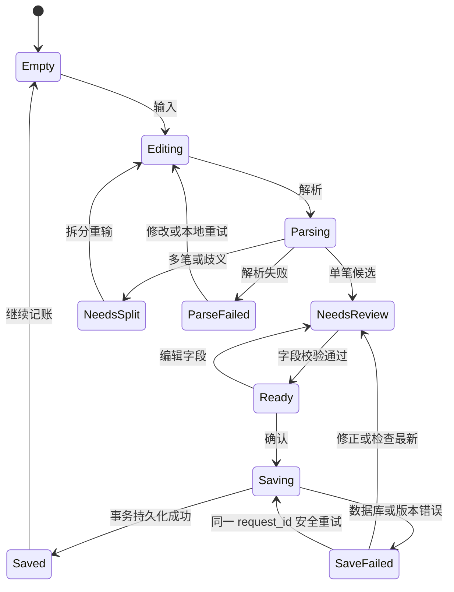

# OpenLedger：界面与交互详细设计

日期：2026-10-02（Asia/Shanghai）  
阶段：2，待用户评审；面向未来 PySide6 / Qt Widgets 实现。  
关联：`OpenLedger-阶段1-需求与技术方案.md`、阶段 2 系统设计与接口契约。  
评审附件：`OpenLedger-交互线框.html`，可离线打开。线框为合成数据，只提供导航、主题与状态示意，不保存账务、不访问网络。HTML 不是应用技术栈。

## 1. 设计目标与共同规则

以自然语言输入为首要入口，始终让用户看清最终入账内容；金额、账户、账本和日期必须同时可见。账户资金与账本统计明确区分，错误有可执行的下一步，后台任务不中断输入。

主窗口采用原生 Windows 标题栏，初始建议 1240 × 820 逻辑像素，最小 960 × 640；原生界面不得以固定像素裁切重要内容。左侧导航约 208 逻辑像素，可折叠到图标栏；主体用可伸缩布局与滚动区。页面按“标题与范围 → 主要结果或输入 → 明细”阅读顺序排列。达到最小宽度时卡片改两列或一列，表格横向滚动，操作区优先保留主按钮。

首版页面：总览、交易明细、账户资产、统计分析、导入导出、设置。账本、分类、标签管理作为交易页/设置页的独立子页面或对话框，避免把所有管理表单堆在首页。

### 1.1 数据范围与金额术语

| 范围/术语 | 页面表达 | 规则 |
| --- | --- | --- |
| 当前账本 | 页面标题下显示“我的账本 · 2026 年 10 月” | 影响收入、支出、退款、最近收支及分析；不改变账户余额 |
| 全局资产 | 卡片显示“全局账户 · 含归档账户” | 当前有效流水汇总的余额；涵盖所有账本，不受统计日期筛选影响 |
| 毛支出 | 当期支出交易金额 | 分类占比和消费排行的默认口径 |
| 退款 | 当期实际退款金额 | 从原支出取得账本与分类，按退款发生日期统计 |
| 净支出 | 毛支出 − 当期退款 | 可以为负；同时展示毛支出与退款的解释 |
| 结余 | 收入 − 净支出 | 是期间流量，不是账户余额或总资产 |
| 归档账户 | 默认账户列表可隐藏，筛选可显示 | 总资产始终包含；不允许因隐藏而改变资产数字 |
| 转账、期初、校准 | 账户流水的特殊事件 | 无账本收支分类；全局事件单独筛选，不计收入/支出 |

交易页“当前账本收支”包含该账本收入、支出及其退款；“全局资金事件”单独入口展示转账/期初/校准。账户流水列明确显示账本名或“全局事件”。若账户被用于分析筛选，按实际资金进出的账户筛选；退款可以进入另一个账户，因此不承诺账户筛选下退款和原支出成对出现。

线框总览与明细范围为 2026-10-01 至 2026-10-02；分析范围为 2026-08-01 至 2026-10-02，示例 8/9 月没有交易。两者例示毛支出 186、退款 30、净支出 156、收入 0、结余 -156；月汇总不会虚构收入。合成账户当前余额为 268.50、6,820.00、386.20、415.30 和归档账户 90.00，总资产为 7,980.00。示例是界面教学数据，不能被当作由线框中的四条记录推导出来的完整账本。

## 2. 页面详细设计

### 2.1 总览

1. 顶部范围：当前账本选择、业务日期范围、账本管理入口。
2. 自然语言输入卡：原文、参考日期提示、本地解析按钮、示例、AI 状态。默认仅本地解析；AI 关闭时不显示暗示必须联网的空白入口。
3. 草稿复核：类型、金额、日期/时段、账本、资金账户、分类、支付渠道、对象、商家/地点、标签及备注。紧凑主字段先展示，次要字段可展开。原文始终可回看。
4. 当期指标：收入、净支出、结余；净支出卡同时显示毛支出/退款拆解。全局总资产独立标识口径。
5. 最近收支：日期、描述、账本、账户、类型、分类、金额；退款显示原支出关联。点击行进入交易详情。
6. 初次空状态：说明当前范围没有记录，提供“输入第一笔”和“设置账户期初”两项操作；没有金额时用 0.00，不显示假的趋势。

选择另一个账本时，只刷新查询范围；已经生成的草稿保持其显式账本，并提示“草稿仍将写入 X”，用户可以手动改动。成功回执同时展示交易编号摘要、账本、账户和金额，避免快速窗口在后台写到错误账本。

### 2.2 交易明细

工具栏：日期、类型、分类、账户、标签、关键字、删除状态，显示筛选摘要及“重置”。模式标签区分“账本收支”和“全局资金事件”。列表使用 QAbstractTableModel，按业务日期倒序、稳定 ID 次序分页/延迟加载，显示行数和加载状态。排序由查询层执行，不仅排序当前已加载页。

详情侧栏：业务字段、相关账户流水、退款关系、来源、修改时间、版本。金额颜色配合带符号金额和类型文本，不靠颜色识别。操作为编辑、退款、删除；删除区提供原因说明和可恢复提示。回收站模式显示恢复按钮。

有活跃退款的原支出：禁用删除/改变类型/换账本，金额不得低于已退款；给出“先处理关联退款”的解释和关联入口。编辑分类会同步影响关联退款的统计归属，确认区给出提示。恢复也重新校验账户/分类状态、日期切点、退款上限和版本，失败保留删除状态并列出原因。

旧版本草稿提交收到版本冲突时，不覆盖较新记录；提示“这条记录已被另一窗口修改”，提供查看最新、复制用户草稿、重新编辑。全局资金事件通过专用表单处理，不借普通收支表单修改。

### 2.3 账户资产

全局总资产卡、账户列表、显示归档选项和货币标签常驻。每张卡显示账户名、类型、余额、状态；负余额使用负号和“负余额”文本。总资产卡不能被账本筛选驱动。未来多币种按货币分组，当前 CNY。

账户详情：余额、余额统计起点 `balance_start_on`、入/出变化、流水、转账/校准/归档入口。期初设置说明切点：早于起点的交易不能直接录入，需先通过专用期初表单调整基准；起点当天允许交易；零期初余额仍保留账户起点，不能通过通用删除操作单独删除 opening 而留下错误起点。起点和期初流水由专用用例一致更新。后续补录影响既有校准之后，展示“历史已改变，请核对余额”，旧校准不自动重算。

转账对话框同时显示转出、转入、金额、日期、备注与“同币种、总资产不变”说明；账户必须不同，手续费另记支出。校准对话框展示最新账面余额、用户核对的余额、固定差额、只读日期“今天”和原因；新增校准仅当前业务日，在写锁内读取当前余额，提交后展示差额流水。旧校准允许按原日期删除/恢复；通用编辑仅改备注/原因，不改金额、日期、账户及余额快照。归档前提示余额仍计入资产，归档账户从新输入候选中移除，但历史查询保持可用；恢复原历史可保留归档实体引用，编辑时保留原引用也允许，若改选实体则必须选择活跃项。

### 2.4 统计分析

顶部固定账本/日期范围、账户/分类筛选摘要。指标使用同一聚合 DTO：收入、毛支出、退款、净支出、结余。趋势按月份补零，收入、毛支出、退款及净支出作为可切换系列；净支出可落到零轴以下。环图只采用正值毛支出，毛支出为 0 时显示无占比状态；分类多时采用排序横条图。

消费排行标识“按毛支出金额”或“按笔数”，退款另列；点击图表分类链接到保持同一筛选范围的交易页。本地分析报告给出可核对的数值和口径说明，不输出凭空建议。零收入时结余率为“不可计算”；缺失对比期不生成增长百分比。导出 PDF/PNG 的标题、范围、货币、退款说明与页面一致。

所有图表都有文本替代：表格切换、系列说明、金额与日期范围。报告生成在后台，可取消，失败保留范围和选项。未来数据规模较大时不在 GUI 线程执行聚合或绘图计算。

### 2.5 导入导出

导入向导分四步：选 CSV/.xlsx → 列映射与目标账本/账户 → 校验与疑似重复预览 → 确认结果。预览行有明确状态“可导入/需修改/错误/疑似重复/已排除”，可以选择接受行集合。顶部显示当前可接受/错误/排除行数，确认前展示会影响哪些账户及预计变化。

金额无效、日期缺失、账户未知、早于期初、公式缓存缺失、多事件等有行号、字段、错误原因和修正建议。模糊重复仅建议，不自动丢弃；稳定外部流水 ID 的严格重复明确标注。提交前确认接受行集合，确认之后数据库异常整批回滚。提交中阻止再次操作，关闭窗口不会中断已开始的资金事务。批次撤销也先校验退款等依赖，失败则保留完整批次。

导出区域分数据交换 CSV/XLSX、报告 PDF/PNG、完整备份三个入口，说明 CSV 不能完整恢复账户关系。格式、日期、账本和内容范围必须可见；路径选择使用原生文件对话框。文件写入失败给出重试或换路径，不能报“导出成功”。

### 2.6 设置与管理

分组为通用（默认账本/账户、主题、语言）、快捷入口（热键、关闭行为）、数据（备份/恢复、数据目录、诊断）、AI（启用、Provider、endpoint、模型、凭据引用、超时、测试连接）、插件状态、更新/关于。

AI 默认关闭。启用前展示发送范围：本次输入与最小候选列表；凭据用专用密码框，不回显至日志、复制摘要和导出。凭据后端不可用时明确提示会话模式，不能暗中落盘。AI/更新测试失败不阻断本地功能。自动更新检查默认关闭，手动检查仅提示 Release；仓库尚未配置时提示配置缺失。

账本/分类/标签管理采用单独列表与编辑表单；历史引用的实体只归档，列表展示归档状态及“保留历史”解释。恢复和余额校准属于需要显式确认影响的操作，所有普通编辑不引入额外弹窗。完整备份创建成功展示位置、时间和校验结果；恢复展示快照版本、保留当前备份、关闭连接/重启要求，失败不能进入正常可写状态。

## 3. 草稿状态、来源与提交

### 3.1 状态机

`Ready` 仅表示字段通过校验，最终仍由应用用例在事务内重新校验。`NeedsSplit` 不允许保存，不自动取首个金额。解析失败保留原文；保存失败同时保留原文、草稿、字段来源与 request_id。提交时立即禁用确认按钮，只在收到事务成功回执后提示已保存；提交结果不确定时以原 request_id 查询/重试，不能直接生成新 ID。

### 3.2 字段证据

| 标识 | 含义 | 例子 |
| --- | --- | --- |
| 明确识别 | 原文提供直接证据 | “128元”“昨天”“微信支付” |
| 规则建议 | 关键词启发式推断 | 火锅 → 餐饮 |
| 默认值 | 用户配置/当前上下文 | 我的账本、默认账户、无日期则今天 |
| 待确认 | 候选冲突/缺失 | 微信渠道可能扣银行卡或零钱 |
| 用户修改 | 用户已改候选 | 用户选招行储蓄卡 |
| AI 建议 | 可选 Provider 返回 | 与本地结果冲突时显示并排差异 |

金额、类型、日期、账本、账户为必填；收支分类必须存在且类型匹配（可选未分类）。日期不能为将来，也不能早于账户时间切点；金额为 CNY 正数且最多两位小数、不得超范围。时段和精度按原文保留，“晚上”不填入虚构的 19:00。商家/地点无证据时留空；“火锅”作为消费描述。标签/备注及关联详情可选，隐藏的非必填区域不能隐藏阻止保存的错误。

例子参考日期为 2026-10-02：“昨天晚上和朋友吃火锅花了128元，微信支付” → 2026-10-01/晚上、128.00、支出、餐饮建议、微信渠道、朋友，账户待确认，商家和地点未知。只有确认扣款账户后草稿才可以入账。

## 4. 键盘、快速窗口与 Windows 集成

| 操作 | 建议行为 |
| --- | --- |
| 主输入框 Enter | 解析；有输入法预编辑文本时先由输入法处理，不触发解析 |
| Shift+Enter | 输入换行；尽管推荐单笔单句，也保留多行修改能力 |
| Ctrl+Enter | 在草稿有效、非输入法预编辑、非保存中时确认入账；快捷提示紧邻按钮 |
| 表单普通 Enter | 遵从当前控件操作，不把主窗口确认设为默认按钮；避免选项选择时误提交 |
| Esc | 未提交时取消草稿/关闭快捷窗口；有修改提示保留到草稿或放弃。保存中不撤销已在提交的事务 |
| Tab / Shift+Tab | 按输入 → 草稿字段 → 复核 → 确认的顺序切换；可见焦点常驻 |
| Ctrl+Alt+L（建议） | 唤起/聚焦快速窗口；配置界面可改，不保证任何机器可注册 |

**阶段 2 将阶段 1 的“普通 Enter 确认”细化为 Enter 解析、Ctrl+Enter 或点击按钮确认**，避免中文候选词确认与入账混淆。此交互纳入本阶段用户评审，在 Qt 验收中用真实 IME 验证；网页 `isComposing` 仅演示防误触意图，不能证明 Qt 事件处理正确。Qt 实现需跟踪输入法预编辑，检查按键和 QInputMethodEvent，提交键绑定不能绕过字段校验。

快速窗口建议 560 × 420 逻辑像素，可拖动/缩放；打开聚焦输入，以当前已确认的快捷默认账本/账户为上下文并展示。原文与草稿足够长时滚动，不遮挡主按钮。保存成功展示回执后允许继续输入；可设置短延时收起，但首次默认留在窗口。主窗口与快捷窗口共享应用服务，草稿各自独立；数据库写入同一队列。

热键注册失败：启动继续成功，状态显示“快捷键被占用”，提供修改或停用。新热键成功注册后再释放旧热键；失败保留旧设置。托盘菜单为打开主窗口、快速记账、最近保存回执、退出；关闭到托盘仅在托盘可用且用户启用时生效，首次给一次说明。托盘不可用时关闭按钮执行正常退出，不能留不可见进程。

明确区分“关闭窗口”和“退出”：退出停止新任务，取消可取消的解析/查询/导出，等待当前提交事务完成或回滚后关闭连接，不能硬杀线程。第二次启动把聚焦请求转交单实例主进程；热键、托盘或第二实例均不直接写库。

## 5. 共同状态与错误处理

| 状态/错误 | 界面行为 | 操作与数据保证 |
| --- | --- | --- |
| 查询加载 | 保留范围，骨架/进度与取消可见 | 不展示新范围下旧数字；旧内容可明确标“上一结果” |
| 空数据 | 0.00 指标，图表无数据文案 | 说明是没有记录还是筛选无匹配，提供新增/清除筛选 |
| DATABASE_BUSY | 保存失败并保留草稿 | 短次数重试仍失败则提示重试；保持 request_id |
| 磁盘满/只读/I/O | 明确未保存，给出数据目录与诊断入口 | 不把流水或余额更新视作成功 |
| 版本冲突 | 展示最新记录和用户草稿 | 不自动覆盖；允许复制内容后重建编辑 |
| 解析/AI 超时 | 保留原文与可用本地候选 | 本地重试、取消或手动填写，不强制联网 |
| 导入异常 | 行级预览错误或批次提交失败 | 提交阶段整批回滚；提供可导出错误报告 |
| 数据库版本过高 | 专用阻断启动页 | 显示应用/数据库版本，阻止写入、提供升级入口 |
| 迁移/恢复失败 | 专用恢复页与备份位置 | 不启动正常写入，留诊断和恢复路径 |
| 网络离线/Release 缺失 | 更新区域内的状态提示 | 不弹阻断对话框，不影响本地记账 |

错误文案包含“发生了什么、是否保存、下一步”，显示稳定错误码，技术堆栈仅出现在脱敏诊断。资金提交错误用持久错误栏，不能仅依赖会消失的 toast；回执可以短提示但可在最近记录中核对。

## 6. 主题、DPI、国际化与可访问性

设计变量：`surface/window/sidebar/raised` 背景层、主/次文本、边框、焦点、选中、成功、支出、警告、错误颜色；间距 4/8/12/16/24/32，按钮最小高度 36，主输入最小高度 72，表格行建议 40。浅深主题共同采用低饱和强调色，图表使用相同 token 与可区分线型。最终文字对比度用计算工具检验，不能仅凭肉眼通过。

字体使用系统可用中文 UI 字体，建议 Microsoft YaHei UI 优先、系统 sans-serif 回退；金额使用可读等宽数字排版。源码和发行不依赖用户另装字体。PDF/图片所需中文字体独立指定并处理许可；屏幕字体与报告字体不可默认为同一个已可用资源。

主题选项为浅色、深色、跟随系统；跟随系统连接 Qt 系统配色变化通知，更新页面、弹窗、托盘兼容图标和图表，不能只改主窗口。DPI 使用逻辑坐标/布局，不对控件几何手工重复乘缩放系数；100%、125%、150%、200% 和跨显示器移动都列为原生验收项。

所有显示文案通过 `tr()` 的稳定 context 处理，`.ts/.qm` 资源进入打包；数据库枚举/ID、快捷键定义和机器交换格式不翻译。自定义账户/分类名称保持原文。首版语言设置切换后提示重启生效，主题立即应用；不承诺热切换全部窗口文案。中文和英文长文案都要验证按钮伸缩、表头、金额单位、日期格式，切换语言不改变历史数据。

每个输入有可读 label、说明和错误关联；图标按钮有 accessibleName 与 tooltip；页码/进度有文本，QAccessible 接口或原生控件状态可被辅助技术识别。颜色同时配合符号和文本；键盘可抵达全部操作，不使用只在 hover 才出现的必要按钮。点击目标建议至少 36 逻辑像素，焦点框与选中框区分；图表有等价表格，屏幕阅读器能读金额、类型、日期和草稿待确认提示。

## 7. 阶段验收表与后续测试

| ID | 验收内容 | 当前阶段验证 | 原生实施阶段验证 |
| --- | --- | --- | --- |
| UI-01 | 六页面导航、范围与全局资产标识 | HTML/文档审查 | pytest-qt 导航、筛选模型 |
| UI-02 | 自然语言字段来源、金额/账户复核 | 静态草稿示意 | 本地解析结果到 Presenter 集成测试 |
| UI-03 | 保存状态防重复、失败保留原文 | 状态机审查 | 重复按键、DB 异常、同 request_id 回执 |
| UI-04 | IME Enter 不提交，Ctrl+Enter 复核 | 设计明确、HTML演示 | Windows 中文 IME 手测 + Qt 事件用例 |
| UI-05 | 跨账本资产、归档资产口径 | 合成数据一致性 | 数据查询/聚合测试 |
| UI-06 | 退款、零收入、负净支出口径 | 公式与页面说明 | 报表/PNG/PDF 共享结果测试 |
| UI-07 | 明细删除/恢复/退款依赖、冲突 | 错误流程审查 | 资金用例集成测试 + GUI 主流程 |
| UI-08 | 导入预览与整批回滚 | 四步线框与错误文案 | 无效行、严格重复、回滚测试 |
| UI-09 | 浅深主题、键盘焦点、长文案 | HTML/CSS 定义检查 | 对比度工具、Qt 深浅主题/英文 |
| UI-10 | DPI/多屏、托盘、热键冲突 | 设计标准明确 | 真实 Windows 100/125/150/200% 手测 |
| UI-11 | loading/empty/error 可恢复 | 状态模式示意 | 任务取消、离线、只读库等注入 |
| UI-12 | 辅助技术与图表表格替代 | 语义标签/设计审查 | Windows 屏幕阅读器、全键盘手测 |

本阶段不运行 GUI/业务单元测试，没有 Qt 截图、真实 IME、打包、DPI 或可访问性实测结果。HTML 基础结构、无外链和示例金额可用本地静态检查确认；检查结果由阶段汇报列出。下一阶段在确认设计后创建 PySide6 骨架，再按 Issue 实现和验证。
