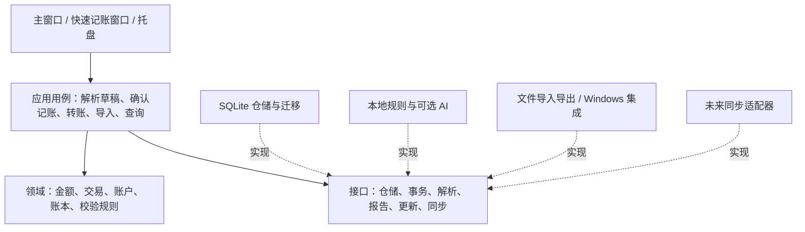

# OpenLedger：阶段 1 需求分析与技术方案

日期：2026-10-02（Asia/Shanghai）  
状态：供评审的方案；项目名为暂定名，尚未进入业务编码。  
本阶段交付：需求基线、技术选型、系统设计草案、质量与发行标准、下一阶段确认事项。完整数据库 DDL、界面原型、接口契约将在阶段 2 冻结。

阶段更新：阶段 2 已交付[系统详细设计](OpenLedger-阶段2-系统详细设计.md)、[可执行 Schema](OpenLedger-schema-v1.sql)和[接口契约](OpenLedger-接口契约.md)。本文件保留阶段 1 的方案快照；实现以阶段 2 为准。详细设计将 `timezone/time_precision` 命名为 `time_zone/occurrence_precision`，并将请求幂等从交易表上的创建请求提升为独立 `command_receipts`，覆盖创建、编辑、删除、恢复和批次命令。

## 1. 产品定位与范围

**面向 Windows 用户的本地个人财务管理应用，以自然语言降低记账成本，以可核对的数据模型保证账户余额和统计结果可信。**

目标用户是希望记录日常消费、管理多个用途账本、查看自己的收支和资产变化的个人。旅行、学习、家庭账本都是同一用户的数据分组；创建“家庭账本”本身不意味着多用户共享或多人协作。

产品原则按优先级排序：资金与数据一致性、数据可恢复、日常操作顺畅、维护成本可控、逐步扩展功能。界面参考 Notion/Obsidian 的简洁布局、留白和侧栏导航，保留 Windows 用户熟悉的窗口、键盘、表格和文件操作习惯。

默认范围：

- 首版单用户、本地 SQLite，无注册或云服务依赖。
- 首版 CNY；金额和账户均携带货币标识，为后续扩展留结构。多币种与汇率核算是待确认项，当前不实施。
- Windows x64，Windows 11 为主要验证环境；Windows 10 的兼容声明以实际测试与选定 Qt 版本为准。ARM64 后续评估。
- 简体中文界面，所有 UI 文案走翻译机制，预留英文翻译文件。
- 默认关闭 AI 和自动联网更新检查；手动检查更新可用。用户开启相应选项后才访问配置的服务。
- 本地数据库和备份首版不承诺加密；API 密钥独立存入 Windows 凭据存储，不放入账本、日志或普通导出。

## 2. 功能基线

“首版”指完成全部实施阶段后的 v1.0，而不是第一个可以启动的原型。

| 需求 | v1.0 交付内容 | 边界与验收重点 |
| --- | --- | --- |
| 基础记账 | 收入、支出、新增/编辑/软删除/恢复、分类、日期、标签、备注；默认“我的账本”，可建旅行/学习/家庭等账本 | 记账与余额在同一事务更新；类别及标签改名不破坏历史；附件先预留元数据与存储接口 |
| 自然语言记账 | 本地规则、可编辑草稿、字段来源提示；可选 AI 解析适配器 | 不配置 AI 也能完整使用；歧义与缺失字段必须可见；解析器没有记账写权限 |
| 账户资产 | 现金、银行卡、微信、支付宝、自定义账户；期初余额、余额校准、收支变化、账户间转账、总资产 | 账户全局共享；账户转账不计收支；总资产按货币统计；只有资产账户时不称“净资产” |
| 数据分析 | 月收入/支出趋势、分类占比、消费排行、筛选、规则生成的财务分析报告 | UI、PDF、图片使用同一聚合结果；空数据、退款、零收入、缺失月份有定义 |
| 导入 | CSV、Excel `.xlsx`，列映射、预览、错误报告、去重候选、用户确认、批次撤销 | CSV 编码/金额/日期校验；Excel 宏和公式不执行；首版不支持旧 `.xls` |
| 导出 | CSV、`.xlsx`、PDF 报告、PNG 统计报告 | 支持账本/日期筛选，中文字体与分页正确；CSV 不是完整备份 |
| 快速入口 | 系统托盘、可配置全局快捷键、快速记账窗口、保存回执 | 建议快捷键 `Ctrl+Alt+L`，注册失败可改键；快捷窗口与主窗口共用记账用例 |
| UI 与主题 | 侧栏、表格、表单、空状态、错误状态；浅色/深色/跟随系统 | 键盘可操作、可读对比度、缩放测试；主题切换包括图表和弹窗 |
| 插件 | AI、导入、分析、主题接口；API 版本和插件元信息 | 第一版支持受控的内置适配器，第三方加载后续增量开放；不建设市场 |
| 同步预留 | 全局 ID、版本字段、软删除、修改日志与同步接口设计 | 不实现账号、远端服务、冲突自动合并；复制数据库文件不等于同步 |
| 工程质量 | 类型提示、文档字符串、pytest、Ruff、mypy、CI、贡献和开发文档 | 强制资金不变量与事务回滚测试，不能仅以覆盖率验收 |
| 软件更新 | 从配置的 GitHub 仓库检查正式 Release，提示版本并打开 Release 页 | 不自动下载/安装；失败不影响本地使用；版本按语义比较 |
| 发行 | 完整源码、包含 exe 的便携 ZIP、Windows 安装 exe | 用户无需 Python；正常退出、升级保留数据、卸载默认保留账本 |

为保证稳定性补充：本地备份/恢复、数据库迁移、导入事务、重复保存防护、删除恢复、错误日志脱敏。退款作为基本资金语义纳入资金核心，避免把退回的钱错误算成新收入。

## 3. 用户使用流程

### 3.1 首次使用

启动 → 创建“我的账本”与默认分类 → 选择实际使用的账户 → 设置账户期初余额与生效日期 → 选择默认记账账户 → 进入首页。初始余额默认为 0；负数期初余额可表达用户已存在的负余额，软件不将其隐藏。不存在的实际余额不会由软件猜测。

银行卡允许用户逐张命名；微信、支付宝作为钱包账户，与其作为支付渠道的含义分开。用户可以只保留现金账户，不必完成全部设置才能记账。

### 3.2 日常自然语言记账

输入原文 → 本地规则生成草稿 → 展示金额、类型、日期、账本、账户、分类及推断来源 → 用户修改/确认 → 校验 → 原子提交 → 显示保存回执，更新余额与统计。

例：以 **2026-10-02** 为解析参考日期，输入“昨天晚上和朋友吃火锅花了128元，微信支付”。

| 字段 | 草稿结果 | 处理原则 |
| --- | --- | --- |
| 类型 | 支出 | “花了”是规则证据 |
| 金额 | 128.00 CNY；内部 12800 分 | 使用十进制解析，拒绝无效/超精度金额 |
| 日期 | 2026-10-01 | “昨天”基于注入的本地时钟解析，可重复测试 |
| 时段 | 晚上 | 不虚构 19:00 等精确时间；保留时段和时间精度 |
| 分类 | 餐饮 | 根据“吃火锅”给出可修改建议 |
| 支付渠道 | 微信 | 不必然意味着扣微信钱包余额，可能由银行卡代扣 |
| 账户 | 按用户映射建议，或待选择 | 若存在多个可能账户，必须确认 |
| 对象 | 朋友 | 先保存为自由文本，不强迫用户创建联系人 |
| 消费描述 | 和朋友吃火锅 | 可作为备注/商家识别线索 |
| 商家 / 地点 | 未确定 | “火锅”不够确定店名或具体地点，保留空值 |
| 账本 | 当前选定账本 | 在草稿和回执中明确展示 |

“咖啡 25元”可建议支出、餐饮、当天与默认账户。默认值与识别值视觉上有所区分。第一版仍需用户确认；当草稿完整时可按 Enter 确认，Esc 取消。保存期间禁用再次提交，提交请求携带唯一 ID，重试不得新增重复交易。

“昨天吃饭128，朋友转我50”“买咖啡25打车40”包含多笔事件；首版返回待拆分提示和候选，不自动合并成一笔或只取第一个金额。类似“1.2万”“￥25.50”“下午3点花25”“去年12月31日”作为明确的规则测试样例；未知金额、未来日期、只有支付方式的输入展示可操作提示。首版记录已发生的交易，未来日期需更正后入账；计划交易与预约执行另行扩展。

### 3.3 资产与分析

账户页面查看实际余额 → 在转账对话框选择转出/转入账户 → 校验同币种、不同账户与金额 → 一次提交两侧流水 → 两个余额同时变化，总资产不变。

分析页选择账本/日期 → 查看收入、净支出与结余 → 点击分类查看明细 → 生成本地分析报告 → 导出 PDF 或 PNG。银行卡手续费单独作为支出记录，不能隐含在转账金额内。

### 3.4 导入、备份与恢复

选择文件 → 指定账本/账户与列映射 → 预览、查看不确定字段和疑似重复 → 确认接受的行集合 → 一个批次原子提交 → 查看报告。无效行先在预览阶段处理；确认之后发生数据库失败则整批回滚。

设置页创建完整备份 → 必要时选择恢复文件 → 校验格式与数据库完整性 → 关闭连接后恢复 → 重启验证余额。新建、升级迁移和恢复都有对应验收用例。

## 4. 技术选型与理由

以下是工程建议，不以“最新版本”替代兼容性验证。具体补丁版本在骨架阶段经 Windows 安装、测试与打包验证后锁定；发布使用锁定依赖。

| 层面 | 建议 | 选择理由与控制成本 |
| --- | --- | --- |
| Python | CPython 3.12 作为初始源码/构建基线候选 | 固定一个解释器版本先打通发行；若依赖或 SQLite 运行库验证不满足则在骨架阶段调整并记录 ADR |
| GUI | PySide6 / Qt 6 Widgets | 原生桌面组件、成熟表格和模型机制；QSS 与统一设计变量支持现代外观；首版不引入 QML 双栈 |
| 持久化 | SQLite + SQLAlchemy 2 Core | 显式事务、可审查查询和映射；仓储返回领域对象，GUI 不依赖数据库行或 ORM |
| 迁移 | Alembic，按 SQLite 特性审核迁移 | 集中管理结构版本，避免启动时零散 `ALTER TABLE`；冻结程序需包含迁移资源 |
| 解析 | 标准库正则、Decimal、datetime + 显式规则表 | 可离线、可解释、可测试；不先引入大型中文 NLP 模型 |
| AI / HTTP | Provider 接口 + httpx 适配器 | 可设超时/取消；OpenAI 或兼容协议按适配器验证，不假定各服务能力一致 |
| 图表 | Matplotlib 嵌入 QtAgg | 桌面图表与 PNG 共用绘图配置；统计计算独立于绘图，避免 UI 和导出口径漂移 |
| Excel / CSV | openpyxl / 标准库 csv | 显式支持 `.xlsx`；不为表格交换增加 pandas 依赖 |
| PDF | Qt QPdfWriter / QPainter | 复用已有 Qt；报告排版单独封装，明确字体、页边距与分页规则 |
| 凭据 | keyring 的 Windows 后端 | API 密钥与普通配置隔离；凭据后端不可用时仅允许会话使用，不静默落成明文 |
| 路径/配置 | QStandardPaths / TOML（非机密） | 数据独立于程序目录；安装/源码运行共用路径规则 |
| 测试 | pytest、pytest-qt、pytest-cov；关键金额不变量可加 Hypothesis | 数据层和用例测试优先，少量 UI 流程测试验证交互 |
| 质量 | Ruff lint + format、mypy、pre-commit | 避免多套格式化规则冲突；领域和应用层采用严格类型规则 |
| 发行 | PyInstaller onedir + Inno Setup | 先验证可诊断的目录包，再制作安装程序；单文件 exe 作为后续可选产物 |

Qt 官方文档明确区分 Widgets 和 Qt Quick，并将 Widgets 描述为成熟稳定的桌面方案；PySide6 wheel 包含 Qt 二进制，无需用户另装 Qt。[Qt for Python 入门](https://doc.qt.io/qtforpython-6/gettingstarted.html)

SQLAlchemy 提供显式事务上下文，Alembic 提供 SQLite batch migration 支持，但迁移仍需审查外键、约束、数据转换与故障恢复。[事务文档](https://docs.sqlalchemy.org/en/20/tutorial/dbapi_transactions.html)、[SQLite 迁移文档](https://alembic.sqlalchemy.org/en/latest/batch.html)

Matplotlib 提供 Qt 嵌入方案及文件输出后端；选择它后仍需要自定义字体、颜色、留白和交互，默认图表样式不是产品最终效果。[Qt 嵌入示例](https://matplotlib.org/stable/gallery/user_interfaces/embedding_in_qt_sgskip.html)、[后端文档](https://matplotlib.org/stable/users/explain/figure/backends.html)

`.xlsx` 使用 openpyxl；PDF 使用 Qt 自带写入器。[openpyxl 文档](https://openpyxl.readthedocs.io/en/stable/)、[QPdfWriter](https://doc.qt.io/qtforpython-6/PySide6/QtGui/QPdfWriter.html)

建议自研代码采用 MIT 许可，最终由维护者确认。分发物同时携带第三方许可与通知，不能用自研代码的 MIT 覆盖 PySide6/Qt 的许可义务；仅收集实际使用的 Qt 模块，并审查它们的许可。[Qt for Python 许可说明](https://doc.qt.io/qtforpython-6/commercial/index.html)、[Qt 许可文档](https://doc.qt.io/qt-6/licensing.html)

## 5. 软件架构草案

采用一个模块化桌面进程，分为领域、应用、基础设施、表现四层。依赖由启动入口组装，业务逻辑可以完全脱离 GUI 运行测试。



表现层负责控件、输入体验、页面状态和 Qt 信号。应用层负责完成一次业务操作、权限边界与事务。领域层负责金额与资金语义，不 import PySide6、httpx 或 SQLAlchemy。基础设施实现数据库、文件、外部服务和 Windows API。

后台任务规则：

- Qt 控件仅在 GUI 线程操作；后台任务通过信号返回结果和结构化错误。[Qt QThread 文档](https://doc.qt.io/qtforpython-6/PySide6/QtCore/QThread.html)
- 数据库写操作进入单一任务队列；事务不跨用户交互或网络请求，避免长时间持锁。
- 导入扫描、分析聚合、网络请求与报告生成按任务管理，可显示进度或取消；每个数据库连接在其所属线程创建和使用。
- 所有入口复用同一记账用例。快捷窗口保存成功不能绕过分类、金额和账户校验。
- 退出时等待正在提交的事务完成，或明确回滚；单实例机制将第二次启动请求转交现有窗口。

## 6. 核心模块和未来目录

以下为计划结构，目录和文件尚未初始化：

```text
OpenLedger/
├── main.py                    # 轻量入口，保留 python main.py 运行方式
├── pyproject.toml             # 包、依赖、工具与入口配置
├── requirements.lock          # 构建环境与依赖锁定（机制在骨架阶段确定）
├── src/openledger/
│   ├── __main__.py
│   ├── bootstrap.py           # 配置、依赖组装、单实例、启动/关闭
│   ├── domain/                # Money、Account、Book、Transaction、规则
│   ├── application/
│   │   ├── dto/               # 草稿、命令、查询、结果
│   │   ├── ports/             # 仓储/UoW/解析/文件/更新/同步契约
│   │   └── services/          # 记账、资产、导入、分析、备份用例
│   ├── infrastructure/
│   │   ├── persistence/       # SQLAlchemy Core 表映射与仓储
│   │   ├── parsing/           # 本地规则
│   │   ├── ai/                # Provider 适配器与凭据访问
│   │   ├── exchange/          # CSV / XLSX 导入导出
│   │   ├── reporting/         # 图表与 PDF / PNG
│   │   ├── platform/windows/  # 托盘、热键、系统集成
│   │   ├── updates/           # GitHub Release 客户端
│   │   └── backup/            # 完整备份、校验、恢复
│   ├── presentation/          # views、presenters、models、widgets
│   ├── plugins/               # 元信息、受控注册、版本校验
│   └── resources/             # 图标、QSS、翻译、许可字体
├── migrations/                # Alembic env 与审查过的版本脚本
├── tests/                     # unit、integration、ui、fixtures
├── docs/                      # 用户、开发、架构、插件、发行、ADRs
├── packaging/                 # PyInstaller spec、Inno Setup iss
├── .github/                   # workflows、Issue / PR 模板
├── README.md
├── CONTRIBUTING.md
├── CHANGELOG.md
├── SECURITY.md
├── LICENSE
└── THIRD_PARTY_NOTICES.md
```

README 将明确功能成熟度、截图、源码运行、下载与数据路径。使用文档解释快捷记账、转账/退款、导入与备份；开发文档覆盖架构、环境、测试、迁移和发行。ADRs 保存账户范围、金额模型、插件边界等长期设计决策。

## 7. 资金模型与数据库 Schema 草案

### 7.1 三个核心概念

- **账本 Book**：按用途组织消费与收入，例如旅行账本。
- **账户 Account**：真实的资金位置，例如现金、某张银行卡、微信钱包；跨账本共享。
- **支付渠道 Payment Method**：交易经过的渠道，例如微信、支付宝；不一定是扣款账户。

首版用“交易头 + 账户流水”的模型，不引入完整企业会计科目系统。交易头保存业务信息；账户流水保存实际余额变动。余额唯一来源是所有有效交易对应流水的汇总，不同时维护一份可随意修改的余额。

```text
账户余额 = SUM(该账户流水.delta_minor，且所属交易 deleted_at_utc IS NULL)
总资产   = SUM(所有有效资产账户余额)，逐货币计算
```

收入：一条 `+金额` 流水；支出：一条 `-金额` 流水；转账：转出 `-金额`、转入 `+金额`；退款：入账账户 `+金额`，与原支出关联。期初余额和余额校准：一条有符号流水，不纳入收支统计。每个账户最多一笔活跃期初事件；零期初余额无需产生一条零金额交易。

余额校准在取得写锁后读取最新余额，记录当时的差额、校准前余额、目标余额与原因；差额为零时只提示已一致，不创建零金额交易。后续补录或修改历史交易不自动重算旧校准差额；界面提示用户重新核对，必要时创建新的校准事件。

期初余额必须有生效日。早于期初生效日的补录/导入可能重复累计已经包含在期初的资金，阶段 2 必须冻结该时间切点规则；首版建议拒绝更早事件，并引导用户先将期初调整为更早的基准。

账户可以出现负余额，并向用户明确展示；首版不建立贷款、信用卡账单和利息模型。被历史流水引用的账户仅允许归档，不允许软删除或物理删除。归档账户保留历史和余额；总资产固定包含它们，不能随界面隐藏账户的选项改变，界面标注“含归档账户”。

### 7.2 表设计

业务实体使用客户端生成的 UUID 文本主键。需要未来同步的实体预留 `created_at_utc`、`updated_at_utc`、`version`、`deleted_at_utc`；审计和批次记录另按生命周期处理。删除字段预留不意味着任意实体都可删除：有历史引用的账户、账本和分类仅归档，领域规则优先于通用字段能力。

| 表 | 主要字段 | 关系与约束 |
| --- | --- | --- |
| `books` | id、name、description、currency_code、is_archived | 初始创建“我的账本”；归档保留交易 |
| `accounts` | id、name、account_type、currency_code、is_archived | 全局账户；不含权威 balance 列 |
| `categories` | id、name、transaction_kind、parent_id、sort_order、is_archived | 首版全局分类、一层父子；禁止循环；被引用的分类通过归档处理 |
| `payment_methods` | id、name、code、is_archived | 与账户分离；可存用户的默认账户映射配置 |
| `transactions` | id、request_id、book_id、kind、amount_minor、currency_code、category_id、payment_method_id、occurred_on、occurred_at_utc、timezone、time_precision、time_period、counterparty、merchant、location、note、source、original_transaction_id、import_batch_id、版本及软删除字段 | 收入/支出直接保存账本/分类；退款通过原交易继承，不存独立副本；转账/期初/校准为全局事件；request_id 唯一；按 kind 冻结可空字段约束 |
| `account_entries` | id、transaction_id、account_id、delta_minor | UNIQUE(transaction_id, account_id)；不独立软删除；有效性继承交易；每种交易的行数/符号/总和由应用用例约束 |
| `tags` | id、name、color、归档及版本字段 | 与交易多对多，实体不用名称作主键 |
| `transaction_tags` | transaction_id、tag_id | 复合主键防止重复关联 |
| `attachments`（预留） | id、transaction_id、relative_path、mime_type、size_bytes、sha256 | 不把图片写入金额表；存储路径限制在数据目录；未实现上传时不显示可用功能 |
| `import_batches` | id、source_format、file_digest、created_at_utc、status、row_count | 支持追溯、预览确认后的原子提交和撤销 |
| `audit_events` | id、entity_type、entity_id、action、old_version、new_version、before_json、after_json、created_at_utc | 与资金变更同事务追加；是本地审计，不宣称防篡改 |
| `change_log` | seq、entity_type、entity_id、version、operation、changed_at_utc | 本地修改日志和未来同步游标来源；不等于已实现冲突解决协议 |
| `alembic_version` | version_num | 结构版本由 Alembic 管理 |

首版可先创建核心资金表和标签表，其余表随对应里程碑迁移新增，不在骨架阶段一次铺满所有功能。

### 7.3 必须冻结的约束

1. 金额用 64 位整数最小货币单位存储，CNY 为分；输入先 Decimal 校验再转换，不用 float 运算账务。交易金额为正数，方向由 kind 和流水符号表达；余额校准的绝对差额作交易金额。超范围及超过两位小数的人民币金额拒绝入账。
2. 数据库用 NOT NULL、外键、UNIQUE、CHECK 保护单行/关联约束，包括金额为整数且为正、流水非零、允许枚举值、关联标签不重复。跨行流水数量、符号和转账守恒不能只靠普通 CHECK；必须在事务内由唯一写入路径校验并测试。
3. 编辑重建当前流水、软删除、恢复、标签更新、审计和修改日志都在同一事务提交；失败后账户余额与旧交易保持一致。恢复必须重新校验所有不变量，不能只清空删除时间；不通过历史余额“加减补丁”修正。
4. 转账不能选择同一账户；首版只支持同币种；两条流水和交易头一起提交，转账行合计为 0。
5. 新增、编辑或恢复退款都要求引用未删除、同币种的原支出，允许部分退款，活跃退款总额不超过原交易金额。存在活跃退款时禁止删除原支出、改变交易类型或迁移账本，禁止把原金额降至已退总额以下。退款账本/分类通过原支出关联取得，原分类修改后退款随之更新；到账账户可不同，退款日期为实际退款日。恢复原支出不自动恢复退款；整组删除或导入批次撤销仍按同一套规则校验，不产生活跃退款引用已删除支出的状态。
6. 收入、支出与退款按 `occurred_on` 的业务日期做日/月汇总。审计用 UTC；未知精确时间可以为空，不能把“晚上”伪装成某个精确时刻。修改系统时区不会重新划分已保存业务日期。
7. 同一数据目录只允许一个应用实例写入；写入串行，版本字段用于拒绝旧草稿覆盖新记录，不用更新时间决定覆盖优先级。
8. 不以相似金额/日期作为绝对去重证据：相同消费可能真实发生两次。外部稳定流水 ID 可以严格去重；同源文件行标识可防重复导入；模糊匹配只提示用户。

| 交易类型 | 流水不变量 | 分类/归属 |
| --- | --- | --- |
| income | 恰好一条 `+amount_minor` | income 分类与指定账本 |
| expense | 恰好一条 `-amount_minor` | expense 分类与指定账本 |
| expense_refund | 恰好一条 `+amount_minor` | 原支出的 expense 分类与账本，通过关联解析 |
| transfer | 不同账户恰好两条等额反向流水，合计为 0 | 全局账户事件，无收支分类 |
| opening / adjustment | 恰好一条非零有符号流水，绝对值等于金额 | 全局账户事件，不计收支 |

索引计划：有效交易 `(book_id, occurred_on)`、`(category_id, occurred_on)`、`original_transaction_id`、`import_batch_id`；账户流水 `(account_id, transaction_id)`；唯一 `request_id`；标签关联反向索引。实际索引通过查询计划和带代表性数据的测试确认。

### 7.4 SQLite 可靠性措施

- 每个连接启用并验证 `PRAGMA foreign_keys=ON`。SQLite 不应被假设默认执行外键约束。[SQLite 外键文档](https://www.sqlite.org/foreignkeys.html)
- 在本地磁盘使用 WAL 的前提是验证实际 SQLite 运行库已包含 WAL-reset 修复；官方说明修复版本含 3.51.3 及后续，以及部分回补版本。构建诊断记录 Python/SQLite/Qt 版本；不满足门槛的源码环境使用已验证的 rollback journal 模式。WAL 检查点与写入由统一队列管理。[SQLite WAL 文档及修复说明](https://www.sqlite.org/wal.html)
- 使用明确事务控制、busy timeout 和耐久性设置，处理 SQLITE_BUSY、磁盘满、只读路径及 I/O 错误，不以“弹出成功”代替持久化成功。
- 备份调用 SQLite backup API 创建一致快照；不能在程序运行时仅复制 `.db`、忽略 WAL 文件。恢复先校验快照与格式，再停止任务、关闭连接、保留当前库备份并替换。[SQLite Backup API](https://www.sqlite.org/backup.html)
- 升级迁移前备份，迁移失败不启动写入。SQLite 表重建迁移不能假定任何 DDL 失败都会自动回滚，恢复路径须测试。检测数据库版本高于应用支持版本时，阻止旧版本写入。
- 数据目录计划为 `%LOCALAPPDATA%\OpenLedger\`，数据库、附件、备份、日志分别管理；不放在安装目录、Git 仓库或网络文件系统。数据库路径未来可配置，但活动数据库不直接放入云同步盘。

## 8. UI 页面设计草案

主布局：左侧固定导航，上部账本选择与自然语言输入，右侧内容区域。采用原生窗口标题栏、统一间距、字号和圆角，避免为外观引入复杂自绘窗口。

| 页面/窗口 | 内容与主要操作 |
| --- | --- |
| 总览 | 本月收入/净支出/结余、全局总资产、最近记录、快速输入；账本数据和全局资产清楚标记 |
| 交易明细 | 账本/日期/类别/账户/标签筛选；分页或延迟加载；详情、编辑、删除恢复、退款 |
| 账户资产 | 账户余额、流水、期初和校准、转账；总资产与归档账户口径 |
| 统计分析 | 月趋势、分类横条/环图、排行、筛选与图表联动、报告导出 |
| 账本/分类/标签管理 | 创建、改名、排序、归档；存在历史引用时提供明确行为 |
| 导入导出 | 文件选择、列映射、校验预览、重复候选、确认与结果 |
| 设置 | 默认账本/账户、语言、主题、热键、备份恢复、AI 服务、插件状态、更新与关于 |
| 快速记账窗口 | 聚焦输入、紧凑草稿、键盘修改/确认、保存回执、错误保留输入 |

图表规范：低饱和主题颜色、清晰单位与时间范围、无数据占位、数值标签、分类长名处理；避免 3D 图。分类较多时用横条图，少量分类可用环图。设计必须验证中文字体、浅深色模式、125%/150%/200% 缩放与键盘焦点。

国际化：显示文案通过 Qt translation 的稳定上下文调用，`.ts` 管理源文案、`.qm` 打包发布；金额/日期格式由展示层处理，数据库枚举与分类 ID 不用本地化字符串保存。用户自定义分类不会因切换语言而自动改名。

系统主题通过 Qt 的系统配色提示与变更通知适配，并以实际 Windows 版本测试结果为准。[QStyleHints 配色接口](https://doc.qt.io/qt-6/qstylehints.html#colorScheme-prop)

## 9. 自然语言、AI 与插件接口

### 9.1 解析流水线

文本规范化 → 多笔与歧义检测 → 金额/日期/账户/分类规则 → 提供草稿与字段证据 → 可选 AI 补充 → 统一结构校验 → 用户确认 → 记账用例。

规则结果是候选而非事实。首版按字段给出“明确识别 / 规则建议 / 默认值 / 待确认”，不展示没有校准过的“98%准确率”。AI 与规则冲突时显示差异；AI 返回无效 JSON、未知类别或错误金额时保留本地草稿，不自动入账。

### 9.2 契约预留

| 接口 | 输入 → 输出 | 权限边界 |
| --- | --- | --- |
| `ParseProvider.parse` | 原文 + 参考日期/时区 + 最小分类/账户候选 → `ParseResult` | 只产生 drafts、warnings、field_evidence，不持有数据库写仓储 |
| `RecordTransaction` | 用户确认的草稿 + request_id → 交易 ID/余额变化/回执 | 完整资金校验与 UnitOfWork 原子提交 |
| `TransferFunds` | 转出/转入/金额/日期 + request_id → 交易结果 | 同币种、不同账户、守恒 |
| `ImportProvider.preview` | 文件 + 映射 + 导入上下文 → 行草稿/错误/重复候选 | 不直接提交；确认后交给导入用例 |
| `AnalysisProvider.analyze` | 只读的聚合 DTO + 报告选项 → 报告数据 | 默认仅本地分析，不读取 API 密钥 |
| `ThemeProvider.load` | 主题 ID → 主题变量/资源描述 | 主题使用数据描述，不需要任意 Python 执行 |
| `AttachmentStore` | 文件元数据/内容引用 → 相对路径及摘要 | 未来实施时包含路径与大小限制 |
| `ReleaseClient.check` | 当前版本 + 已配置仓库 → 更新状态/Release URL | 不接触账务；不下载程序 |
| `SyncProvider`（预留） | 变更游标/批次 → 拉取或推送结果/冲突 | 不在 v1.0 启动任务；真实冲突语义须后续 ADR |

这些是进程内 Python 契约，以类型化 DTO 与 Protocol 表达；首版不启动 HTTP 服务。后续 CLI 或 REST 层可复用应用用例。完整字段、错误码、线程约束与版本兼容将在阶段 2 明确。

AI 配置包括服务类型、HTTPS endpoint、模型、凭据引用、超时与启用状态。允许明确配置 localhost 自托管服务。软件默认不绑定服务；未经配置与授权不发送账务文本。请求尽量只含本次输入和最小候选列表，不发送完整流水；默认不发送图片或原始数据库，不在日志记录密钥、完整提示词或账务响应。

网络请求在后台执行，支持超时和取消。确认提交用例可离线完成；AI 不可用只影响解析建议。keyring 的 Windows 后端用于凭据保存。[keyring 支持的后端](https://pypi.org/project/keyring/)

插件 manifest 预留 id、version、api_version、capabilities、配置 schema 与入口。首版为内置适配器实现注册机制并验证边界，不扫描下载目录自动执行代码。第三方 Python 插件属于用户信任的本地代码，manifest 不是安全沙箱；真正隔离执行留到后续扩展。

未来云同步不能简单按 `updated_at` 覆盖，也不能合并两份余额。保留 ID、版本、软删除与修改日志是必要准备，交易及其流水必须作为完整聚合原子同步；并发编辑、重复导入、退款冲突、密钥与附件同步仍需单独设计。

## 10. 分析与导入导出口径

报告口径在查询服务统一定义：

- 收入总额：有效 income 交易金额，不含期初、校准、转账或支出退款。
- 支出总额：有效 expense 交易金额；退款额单列；净支出 = 支出总额 − 当期退款额。
- “当期”同时满足所选业务日期、账本、分类等筛选；退款的账本/分类从原支出取得。若筛选账户，按实际流水账户筛选，退款可能退到与原付款不同的账户。
- 结余：当期收入 − 当期净支出；不是账户余额，不能用于推导全局总资产。
- 分类占比默认用毛支出作为正值分母，旁边单列退款/净支出；避免当期退款大于支出时出现负数环图。
- 毛支出为零时显示无占比状态，不绘制环图；当期只有退款时仍显示退款额与净支出数字。
- 月度退款记在发生月份，不默默改写过去的历史月报。排行明确选择按金额或笔数，退款单列。
- 收入为 0 时结余率展示“不可计算”，空月份补零；对比期缺失不生成误导百分比。

首版报告采用本地模板和可复核规则，描述趋势与数据事实。AI 生成建议作为未来可选分析插件，不与基础统计绑定。

导入使用明确规范化格式，复杂的微信/支付宝/银行专有账单逐步通过适配器支持；不承诺任何厂商账单都能自动识别。CSV 金额以字符串/Decimal 校验，支持常见 UTF-8（含 BOM）与可选 GB18030；Excel 日期、文本金额、公式缓存缺失和不同小数格式均需要预览校验。

导出文本字段按实际文件格式处理公式注入，`.xlsx` 写为文本，CSV 提供安全导出及明确可逆的转义规则。包含 ID/类型/账户/分类/货币/业务日期的交换格式设 format_version；完整备份另外包含数据库和未来附件，不依赖普通 CSV 恢复所有关系。

## 11. 工程与发行流程

### 11.1 测试设计

| 层次 | 必测场景 |
| --- | --- |
| 数据库 | 外键、金额约束、迁移升级、迁移失败恢复、事务回滚、锁/只读/磁盘失败、备份恢复 |
| 资金逻辑 | 期初、收入、支出、转账守恒、编辑/删除/恢复、部分退款与累计上限、校准、重复提交 |
| 解析 | 相对日期/跨年、金额格式、付款渠道与扣款账户、多金额歧义、缺失字段、AI结构错误 |
| 分析 | 空数据、月份补零、退款口径、转账排除、账本过滤、UI与导出结果一致 |
| 文件交换 | 编码、日期/金额格式、公式文本、重复候选、批量失败回滚、撤销 |
| GUI | 启动、保存错误保留草稿、快捷窗口、主题、页面刷新、关闭到托盘、取消任务 |
| Windows 集成 | 热键冲突、单实例、托盘退出、打包启动、升级与卸载的数据保留 |

阶段 3 起实际运行与变更匹配的测试；每阶段记录命令、结果和不能自动化的手测项，再等待下一步指令。本阶段仅设计测试清单、审查需求与文档，**没有业务代码，因此没有可运行的业务单元测试或 CI 结果**。

### 11.2 CI 和开源维护

GitHub Actions 的 PR 工作流：依赖安装 → Ruff lint / format check → mypy → pytest / coverage → 必要的 Windows UI smoke。数据库迁移测试使用真实临时 SQLite 文件。纯逻辑可补 Linux 任务，但 Windows 任务是目标平台验证。

可信分支定期或按需运行冻结程序 smoke；Release 工作流只由维护者控制的 tag / 手动触发生成 Windows 制品、校验和与发行说明。默认权限为只读，发布任务单独获得必要权限；外部 PR 不接触发布或签名 secrets，第三方 Actions 固定完整 commit SHA。[GitHub Actions 安全使用文档](https://docs.github.com/en/actions/reference/security/secure-use)

采用小型 Issue → 小型 PR → 审查 → 检查通过 → changelog 更新的流程。每个 Issue 包含验收标准、依赖和不做事项；发布采用语义版本，早期 API 明确允许调整。问题报告模板提示提供脱敏样例，不要求上传完整账本。

### 11.3 Windows 发行

目标制品（未来交付，不是当前已有文件）：

- 完整 GitHub 源码、源码归档与依赖锁；安装依赖后支持 `python main.py` 及模块入口。
- `OpenLedger-vX.Y.Z-windows-x64-portable.zip`：解压后运行 `OpenLedger.exe`，同目录保留依赖与第三方通知。
- `OpenLedger-vX.Y.Z-windows-x64-setup.exe`：Inno Setup 安装程序，默认当前用户安装，可无需管理员权限；升级复用固定 AppId。
- `SHA256SUMS.txt`、Release notes、第三方许可说明；签名是否提供由维护者后续决定，无签名的用户体验以实测记录。

PyInstaller 不是跨平台编译器，Windows 制品必须在 Windows 环境构建。官方建议先验证 onedir 再尝试 onefile，故单文件便携 exe 暂列为可选增强。[PyInstaller 发行机制](https://pyinstaller.org/en/stable/operating-mode.html)

Inno Setup 负责 Windows 安装、快捷方式、升级与卸载；实际工具版本和许可在发行时固定并记录。[Inno Setup 官方介绍](https://jrsoftware.org/isinfo.php)

打包必须收集 Qt 平台插件、图标、翻译、字体许可、Matplotlib 资源和 Alembic 迁移文件。先在骨架阶段完成一次 exe 启动验证，最终在没有 Python 的干净 Windows 环境手测中文路径、普通账户权限、主题、热键、报告与升级保留数据。

### 11.4 更新检查

查询已配置 GitHub 仓库的正式 Release；过滤/验证版本标识，用版本解析器比较，不能用字符串比较。处理 404（尚无 Release）、限流、离线、超时及无效 tag；缓存检查时间，启用自动检查时限制频率。提示新版本后由用户打开 Release 页，不启动下载或安装。[GitHub Releases REST API](https://docs.github.com/en/rest/releases/releases)

仓库 owner/repo 尚未提供，正式地址在仓库初始化时配置；不能把占位地址当成工作的更新服务。

## 12. 实施节奏与后续扩展

详细任务见同目录《OpenLedger-开发计划与Issue草案.md》。阶段顺序：

1. 需求分析与技术方案（当前）。
2. 系统详细设计：ER/DDL、用例接口、页面线框、错误状态、ADRs、测试与发行设计冻结。确认后进入代码。
3. 工程骨架：仓库/文档/测试工具/CI、最小 Qt 启动与早期 Windows 打包。
4. 资金核心：数据库、迁移、账户/账本、资金事务、退款、备份恢复。
5. 规则记账与主界面：本地解析、草稿确认、交易列表与管理页面。
6. 统计与交换：图表、报告、CSV/XLSX、PDF/PNG。
7. 系统集成与扩展：托盘、热键、快速窗口、AI 适配器、主题/i18n、更新、插件与同步契约。
8. 发行候选与 v1.0：文档补全、完整回归、便携 exe/安装程序、干净机器验收。

每阶段交付完成项、关键结构、实际验证结果、已知问题；每阶段结束等待用户指令，不在同一次指令中跳过评审推进所有代码。

未来扩展按优先级独立规划：自定义识别规则与专有账单导入、预算/周期交易、图片/OCR、贷款/信用卡模型、多币种与汇率快照、多设备同步、受信任第三方插件。预留接口不意味着这些已承诺在 v1.0 实现。

## 13. 下一阶段需要确认的设计决策

| 决策 | 本方案建议 | 影响 |
| --- | --- | --- |
| 名称与目录 | 暂定 OpenLedger；正式仓库建议 `D:\Code\OpenLedger` | 不在本阶段移动工作区或初始化 Git；发布前核查名称冲突 |
| 首版货币 | CNY 单币种，预留 currency_code | 若首版多币种，需增加汇率快照、跨币转账与报告折算设计 |
| 账户范围 | 全局账户，多账本共用 | 同一银行卡不会因切换账本出现两份余额 |
| 自动记账含义 | 自动解析，用户确认后保存 | 避免不确定输入直接改变资金记录 |
| 许可 | 自研代码 MIT，第三方许可另列 | 由维护者最终确认，不代替依赖许可要求 |
| Excel 范围 | `.xlsx`；旧 `.xls` 后续适配 | 控制依赖与兼容测试范围 |
| exe 形式 | 首发便携目录包内 exe + 安装 exe | 是否追加单文件 exe 在打包实测后决定 |

本方案覆盖原始 12 组功能及维护要求。阶段 1 的“完成”表示设计材料已备齐，不表示已实现功能、已发布仓库、已通过业务测试或已生成 exe。
