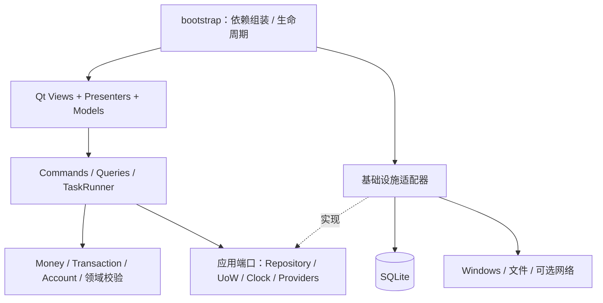
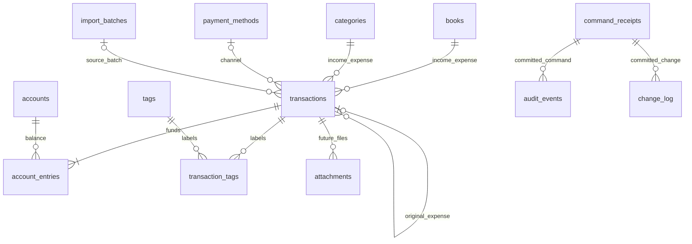

# OpenLedger：阶段 2 系统详细设计

日期：2026-10-02（Asia/Shanghai）  
状态：系统设计交付，待本阶段评审；尚未初始化产品仓库或实现业务功能。用户已指示从阶段 1 进入阶段 2，本设计沿用阶段 1 的 CNY、全局账户、确认后记账、MIT 自研代码、Windows x64 与 `.xlsx` 范围。

## 1. 本阶段设计包与实施边界

| 文件 | 作用 |
| --- | --- |
| [SQL Schema](OpenLedger-schema-v1.sql) | 可在临时 SQLite 中执行的 v1.0 结构目标，包含约束、索引和只读视图；不是已发布迁移 |
| [接口契约](OpenLedger-接口契约.md) | DTO、命令、查询、错误、解析/插件/同步接口、事务和取消语义 |
| [页面与交互](OpenLedger-界面与交互设计.md) | 页面结构、作用域、草稿状态、键盘行为、主题和验收 |
| [交互线框](OpenLedger-交互线框.html) | 离线静态设计预览，只有演示交互，不读写账务 |
| [验证记录](OpenLedger-阶段2-验证记录.md) | 实际执行的 Schema 检查及尚待实现的测试 |

本设计解决阶段 1 留下的期初时间切点、退款关联、提交幂等、后台取消和数据生命周期问题。下一阶段只实现工程骨架、工具/CI、最小窗口和第一次 Windows 打包；完整资金表按资金核心阶段迁移，后续导入和附件表按功能阶段增加。

项目名沿用 OpenLedger。正式工作目录拟为 `D:\Code\OpenLedger`；阶段 3 初始化时先检查目标目录现有内容及上层 Git 边界，避免覆盖既有工程或在父仓库内误建子仓库。本阶段设计材料保留在当前工作区 outputs。

## 2. 软件架构与依赖约束

应用是一个桌面进程；同一数据目录只运行一个可写实例。采用 Qt Widgets + Presenter 的页面组织方式，Presenter 将应用 DTO 转成 Qt Model 和视图状态。



| 层 | 可以依赖 | 禁止耦合 | 验证方式 |
| --- | --- | --- | --- |
| domain | Python 标准库、纯类型 | Qt、SQLAlchemy、HTTP、文件路径 | 纯单元测试与导入边界检查 |
| application | domain、应用端口、DTO | QWidget、原始 SQL、具体 AI SDK | 用替身仓储/时钟/Provider 测试用例 |
| infrastructure | application、domain、第三方库 | 直接改 GUI、绕过记账用例生成资金记录 | 临时文件数据库与适配器测试 |
| presentation | application DTO/用例、Qt | 自行计算余额、直接写表或调用 AI HTTP | Presenter 测试与关键 Qt 流程 |
| bootstrap | 全部层 | 业务规则 | 启动、退出、配置与资源路径 smoke |

模块拆分按能力，而非按每个控件建一套服务。资金变更集中于 `TransactionService`；余额和收支查询集中于 `FinanceQueryService`；自然语言负责 `ParseResult`，不拥有 UnitOfWork。

## 3. 项目目录与职责

```text
OpenLedger/
├── main.py                          # 薄入口；源码安装后 python main.py
├── pyproject.toml                   # 元数据/依赖/入口/工具
├── requirements.lock                # 阶段3确定的构建依赖锁
├── src/openledger/
│   ├── __main__.py
│   ├── bootstrap.py
│   ├── domain/
│   │   ├── money.py                 # Decimal输入、整数分、范围
│   │   ├── entities.py              # 账户/账本/分类/交易聚合
│   │   ├── transaction_rules.py     # 种类、流水、退款、切点
│   │   └── errors.py
│   ├── application/
│   │   ├── dto/                     # 命令、查询、草稿、回执、报告
│   │   ├── ports/                   # UoW/仓储/Clock/Provider/Task
│   │   └── services/                # 资金、查询、解析、导入、备份
│   ├── infrastructure/
│   │   ├── persistence/             # schema映射、仓储、写UoW
│   │   ├── parsing/                 # 可版本化规则与字段证据
│   │   ├── ai/                      # HTTP适配、凭据、能力探测
│   │   ├── exchange/                # 交换格式、CSV/XLSX
│   │   ├── reporting/               # 聚合DTO→图表/PDF/PNG
│   │   ├── platform/windows/        # 热键/单实例/系统集成
│   │   ├── updates/
│   │   └── backup/
│   ├── presentation/
│   │   ├── views/                   # 窗口、页面、对话框
│   │   ├── presenters/              # 状态与交互协调
│   │   ├── models/                  # QAbstractTableModel等
│   │   └── widgets/                 # 输入条、草稿、空/错状态
│   ├── plugins/                     # manifest、注册与兼容版本
│   └── resources/                   # icons/themes/i18n/fonts/licenses
├── migrations/                      # Alembic环境与增量修订
├── tests/{unit,integration,ui}/
├── docs/{user,development,architecture,adr}/
├── packaging/{pyinstaller,inno}/
├── .github/{workflows,ISSUE_TEMPLATE}/
└── README / CONTRIBUTING / CHANGELOG / SECURITY / LICENSE / notices
```

以上是待创建结构，当前没有对应业务模块。依赖按实现里程碑引入，避免最小骨架先加载图表、Excel 和网络模块。所有资源通过包资源或明确的冻结资源目录读取，不依赖用户启动程序时的 cwd。

## 4. 数据模型、ER 与约束责任

### 4.1 关联关系



ER 中的账户流水最低行数是有效聚合的领域约束，不能仅凭外键确保；必须通过用例检查。退款通过 `original_transaction_id` 继承账本/分类，退款自身不保存可编辑的副本。查询退款时使用实际退款日和到账账户，原支出日期不替代退款日期。

### 4.2 金额与时间冻结

- `currency_code='CNY'`；收入、支出、退款、转账的 `amount_minor` 是正整数分。
- 每笔金额上限 `MAX_AMOUNT_MINOR=99_999_999_999_999` 分，明确处理输入范围与溢出，不静默截断。
- 账户余额与最终聚合结果范围为 signed int64；内部 Python int 保留精度，越界返回明确错误。JSON交换中的金额序列化为十进制字符串，进程内 DTO 使用 int。
- 期初/校准的 amount 是差额绝对值，正负由唯一流水表达；零差额不建交易。
- `occurred_on` 是合法的 `YYYY-MM-DD` 业务日期，统计范围按 `[start_on, end_on)`。
- 精确时间以 UTC 保存；`occurrence_precision` 区分 date/period/exact，晚上等保存在 `time_period`，不生成虚构时刻。
- 审计与回执时间统一 UTC，格式在契约中定义；不使用本机文件时间作业务日期。
- 每个账户的 `balance_start_on` 是期初切点，当日交易有效；所有相关资金事件不得早于该日期。零余额仍保存切点，没有零金额 opening。
- 非零期初事件必须在切点当天，每账户最多一笔活跃期初；切点当天所有其他交易都是快照后的资金变动。首版不表达精确到小时的期初快照。
- 用户调整切点必须在账户管理用例中检查已有流水；不能将切点推到活跃资金事件之后。更早历史导入先由用户明确调整期初基准，不能把旧期初与更早资金事件直接相加。
- 专用 `SetAccountOpening` 命令原子更新切点与期初事件；通用交易编辑/删除/恢复不操作 opening，防止切点与期初脱节。
- 新的 `AdjustBalance` 仅按当前业务日的当前余额生成固定差额，日期在界面只读。旧校准可保持原日期删除/恢复；普通编辑只改备注或校准原因，资金金额/日期/账户/快照保持固定。
- 首版只提交已发生事件；未来日期由应用的可注入 Clock 拒绝，数据库不使用随时间变化的 CHECK。

Windows 通常没有系统 IANA 时区数据库，源码与冻结程序计划包含 `tzdata`。用户使用可配置的 IANA 时区；系统时区到 IANA 的映射由 Windows 适配器处理并可手动覆盖。Asia/Shanghai 是当前示例时区，不是对所有用户写死的默认值。[Python zoneinfo 文档](https://docs.python.org/3/library/zoneinfo.html)

### 4.3 SQL 能力与应用不变量

DDL 使用 STRICT 表，明确列类型、NOT NULL、外键、CHECK 与 UNIQUE。运行库最低满足 SQLite 3.37.0，JSON 函数须启动探测；启用 WAL 还需满足阶段 1 已核实的修复版本要求。STRICT 会做无损类型转换，并不意味着调用者传入 `25.0` 就一定被拒绝；领域边界仍以 Decimal 和 Python int 校验。[STRICT 表](https://www.sqlite.org/stricttables.html)

| 条件 | 数据库保护 | 应用必须检查 |
| --- | --- | --- |
| 金额 | INTEGER、正数、上限；流水非零有范围 | 输入十进制精度、单位转换、总余额范围 |
| 关联 | 账本/分类/账户等外键，删除策略 RESTRICT | 归档对象能否用于新记录、币种/类别种类一致 |
| 交易形状 | kind允许值与字段可空关系 | 各种类的流水条数、符号、金额 |
| 转账 | 关联账户存在、每交易同账户不重复 | 不同账户、同币种、两个切点、金额守恒 |
| 退款 | 原交易引用存在、不得自引用 | 原交易有效expense、同币种、累计退款上限 |
| 删除恢复 | 删除时间格式及保留历史 | 恢复重新检查资金/退款/期初/归档引用约束 |
| 幂等 | command_receipts主键唯一 | 同ID相同规范化payload重放；不同payload报冲突 |
| 乐观版本 | version为正整数 | expected_version检查、成功递增、拒绝旧草稿 |
| 日期 | 格式与精度字段组合 | 真实日历、时区、未来日期、账户切点 |

SQLite CHECK 不允许子查询，表达式求值为 NULL 时也不会自动产生约束错误，因此可空条件必须显式写清，跨行资金约束由唯一写入路径校验。[SQLite CREATE TABLE 与 CHECK](https://www.sqlite.org/lang_createtable.html)

余额视图包括零流水账户和归档账户，并排除软删除交易。统一收支视图输出收入、毛支出、退款和净支出增量；转账、期初和校准均为 0。分类比例使用毛支出分母，毛支出为 0 时无比例图。

SQL `sum()` 的整数溢出映射为明确查询错误；不能改用浮点 `total()` 悄悄失去精度。超出 SQL 聚合范围时，可由 Python int 对分组数据求和并检查显示范围，行为必须测试；不能展示近似余额。[SQLite 聚合函数](https://www.sqlite.org/lang_aggfunc.html)

## 5. 资金用例与提交语义

### 5.1 单一写入路径

每个变更命令含 `request_id`、规范化业务载荷、需要时的 `expected_version`。不把创建 request_id 放在交易表里承担所有操作的幂等；统一由 `command_receipts` 保存已提交的命令结果。

提交顺序固定为：

1. 在应用边界做无数据库依赖的格式校验；生成规范化 payload hash。
2. 写任务队列获取 write UnitOfWork，基础设施用 `BEGIN IMMEDIATE` 在读取余额/退款额度前取得写锁。
3. 查询 request_id：同种命令同 hash 返回原提交回执；任何差异返回 `IDEMPOTENCY_KEY_REUSED`。回执重放优先于旧版本校验。
4. 读取最新实体，校验 expected_version、账户/账本/分类、切点、币种和关联规则。
5. 构造完整交易与全部流水，验证资金不变量；编辑替换该聚合的当前流水。
6. 写入标签、审计、change_log 和 command_receipt；相关内容在同一数据库事务中。
7. 在提交前的安全点响应取消；提交成功后产生回执并发出变更通知。
8. UI 收到成功结果后刷新只读查询。重放回执含当时操作结果；当前余额另行查询，避免展示过时余额。

失败命令整次回滚，不保存“已成功”回执。业务错误不盲目重试；短暂锁冲突可以有限重试同一 request_id。重试预算、默认 busy timeout（拟 5000ms）与 UI 进度在实现中验证。

`BEGIN IMMEDIATE` 可能因其他写入连接而返回 SQLITE_BUSY；写 UoW 的事务控制必须与 Python sqlite3/SQLAlchemy 自动事务行为一致，具体引擎配置在资金核心集成测试中冻结。[SQLite 事务文档](https://www.sqlite.org/lang_transaction.html)

### 5.2 编辑、删除、恢复

交易 ID 保持不变；成功编辑 version+1、流水整体重建，审计保存变更前后快照。首版已创建交易的 kind 固定，修改类型采用显式新建替代，避免隐藏地改变退款或资金语义。opening 仅通过账户期初用例设置，不能在普通列表中单独删改。

交易软删除保留流水与审计，查询统一按头的删除状态过滤。恢复会重验所有不变量；恢复原支出不恢复曾删除的退款。活跃退款存在时禁止删除原支出、迁移账本或降低金额至已退款以下；原分类可改，退款通过关联自然随之变化。

退款业务日期不得早于原支出日期；修改原日期时也必须检查所有活跃退款。限制按活跃退款计算，已删除的退款不会永久冻结原支出；后续恢复退款时重新校验原支出与全部资金规则。

批次撤销若遇到其他批次新增的活跃退款引用，整批撤销拒绝并展示阻塞记录。若原支出与退款均在此次撤销集合内，先按依赖排序撤销退款再撤销原支出，一次提交；不产生中间有效但引用删除原支出的状态。

归档是停用新输入选项，不改变历史与资产。旧记录可以查看、软删和恢复；恢复到归档实体允许维持原历史关联，新建或把记录改到归档实体则拒绝。空账户若需移除也先归档；首版不提供实体物理清除功能。

## 6. 后台任务、线程和应用生命周期

| 执行位置 | 职责 |
| --- | --- |
| GUI线程 | 控件/Qt Model、Presenter状态、输入、消息与界面刷新 |
| 唯一写工作线程 | 资金事务、批次提交、写库配置、变更回执；连接在该线程创建/释放 |
| 有界后台任务池 | 解析、文件预览、独立只读查询、HTTP、报告计算；每任务持自己的资源 |
| 启动/维护协调器 | 单实例、迁移、备份/恢复、关闭与任务门控 |

采用 Qt signals/slots 连接，不在 GUI 主线程等待 `.result()` 或网络。线程之间传不可变 DTO，不传数据库连接、可变草稿或 QWidget。图表计算可在后台，QtAgg canvas/控件更新在 GUI 线程；Matplotlib 渲染任务串行或各自独立，避免共享 pyplot 全局状态。

任务取消为协作式。预览取消无写入；提交前取消回滚；commit 后取消请求返回“已提交”而非“已取消”。无法取消的短临界区只显示“正在完成”。

解析任务持 `draft_id`、`draft_revision`、`task_id`；用户改输入、账户、类别或金额即递增草稿版本。过时 AI 响应不覆盖新状态。HTTP重试不能触发重复资金提交。

初始化顺序：配置/路径 → 单实例守卫 → 环境版本探测 → 数据库版本与迁移检查 → 服务组装 → 主窗口 → 可选托盘/热键。关闭到托盘只隐藏窗口；明确退出时停止新任务、结束/回滚正在提交的操作、释放热键与托盘、关闭连接，再退出。

单实例按当前用户+数据目录标识，使用 Qt 本地锁与本地 IPC。锁竞争、陈旧锁和 IPC 失败均有明确错误；不凭存在一个文件就删除它。Windows 全局快捷键通过 RegisterHotKey/UnregisterHotKey 适配，并处理注册冲突。[RegisterHotKey 官方文档](https://learn.microsoft.com/en-us/windows/win32/api/winuser/nf-winuser-registerhotkey)

## 7. 配置、备份、迁移与数据生命周期

数据目录：`%LOCALAPPDATA%\OpenLedger\`，实际由路径服务解析。划分 database、attachments、backups、logs；普通配置为带 `config_version` 的 TOML，机密仅用 Windows 凭据后端。普通配置采用临时文件写完再替换；不能因配置损坏自动删除数据库。

密钥后端不可用时保持已有非机密设置，提示凭据错误；允许用户选择会话使用，退出后清除内存引用。普通导出和完整账本备份均不包含 API Key；程序日志默认不含原始自然语言、备注、完整AI响应与个人账务。

备份为带 `backup_format_version` 的 ZIP：manifest、SQLite一致快照、必要附件和可选非机密设置。manifest包括应用版本、Schema版本、UTC创建时间、每文件摘要及相对路径。首版图片未实现时附件集合为空，但格式已定义。

备份任务暂停资金写队列，等待在途提交完成，用 backup API 得到一致快照，复制快照引用的附件，完成后释放门控；普通只读查看仍可用。先在临时目录构建、校验，然后发布备份文件。不能把CSV当完整恢复包。

恢复步骤：读manifest/校验摘要与大小/路径 → 临时库 integrity_check、foreign_key_check和资金不变量检查 → 与当前应用支持Schema比较 → 保存当前库快照 → 停止新任务/关闭全部连接 → 同盘替换数据 → 重启服务并重新查询。ZIP路径不允许逃逸恢复临时目录；未知格式、缺附件、损坏库、版本过新均在替换前拒绝。

迁移采用“先备份、在暂存副本迁移、检查通过后切换”策略；SQLite重建表、外键或DDL失败不能依靠未经验证的事务假设。切换前关闭所有连接并处理WAL检查点，避免把旧sidecar文件应用到新库。写清切换恢复标记，崩溃后恢复到完整旧库或完整新库。旧版应用发现高版本数据库时阻止写入。

## 8. 导入导出与统计格式

交换格式 version=1，以列说明金额单位、币种、交易种类、业务日期、账本/账户引用。可选稳定来源命名空间与流水ID；命名空间包含provider+外部账户ID，防止同一转账在不同账户的来源ID互相冲突。没有稳定来源ID时用文件摘要+映射摘要+行号识别同一导入；映射摘要包括列规则、目标账本/账户、时区及格式版本。严格去重保留已软删除记录的身份，再次导入需恢复或处理冲突；更换映射仍做模糊重复提示。

预览得到不持久化的 `ImportPlan`，冻结文件摘要/映射/接受行/解析结果。提交前重新校验摘要与当前实体状态；文件被修改或账户被归档返回可重做预览的错误。批次与所有交易、回执、审计同事务；读取大文件可分块，提交不能留下成功一半的批次。首版限制导入规模（拟每批最多10000行、文件20MiB），UI在预览前显示限制，性能验证后调整。

退款需要明确匹配本地原支出；无法匹配时标待确认，不自动转成收入。账户转账导入必须明确双方，避免把同一转账两张账单导成两次。XLSX不执行宏或公式；公式值只接受已验证的缓存标量，缓存缺失的金额/日期要求人工纠正。

报告查询使用同一 `ReportQuery` 和聚合DTO：按业务日期、账本、类别和实际流水账户过滤；退款沿原支出分类/账本、按实际退款日归集。页面、PDF和PNG消费同一结果。报告列收入、毛支出、退款、净支出、结余和时间范围；零分母/无记录显式描述，不生成虚构增长率。

CSV安全文本导出采用明确可逆的转义标记并在交换格式注明；XLSX把用户文本写成文本单元格。PDF/PNG包括格式和货币单位、生成时间、数据范围和“本地统计”说明；用户选择的不同字段和筛选不会默默改变资产口径。

## 9. 扩展与发行预留

插件能力类型分别是 parse、import、analysis、theme；manifest版本、api_version、入口和配置schema必须校验。首版注册内置适配器，第三方可执行代码后续由用户明确安装/启用。主题能力默认只交付资源数据，不需要Python执行。Python插件与主进程权限相同，capability声明不构成沙箱。

同步仅预留 `SyncProvider` 与聚合格式：一笔交易及全部流水/标签作为原子单位，UUID和版本标识实体，change_log提供本地序号游标。不得按时间戳覆盖余额；删除墓碑、并发退款、原支出分类/账本变更、重复来源和附件去重需未来单独ADR。v1.0没有同步按钮或空实现假称可用。

更新查询仅发送应用版本和已配置GitHub仓库请求，不接触账务。正式Release解析、语义版本、限流/离线/未发布结果分别表示；失败不能显示已是最新版。自动检查默认关闭；提示后由用户打开Release页。

阶段3就验证最小 onedir 冻结包启动；正式发行Windows构建包含 Qt平台插件、迁移资源、主题/翻译、中文字体许可与图表资源。Inno安装器采用固定AppId和当前用户安装；升级保留数据，卸载默认保留本地账本。签名凭据不进入源码/普通CI；Release workflow只在可信上下文拿到发布权限。

## 10. ADR 与下一阶段门禁

| ADR | 冻结决策 | 理由与后果 |
| --- | --- | --- |
| 001 | 全局账户、账本归属交易 | 一个真实账户不出现多份余额；账本结余和资产分开展示 |
| 002 | 整数分+交易头/流水 | 精确金额、转账原子性；无余额缓存作为第二来源 |
| 003 | 草稿确认、解析无写库权限 | 明确歧义，允许本地/AI替换而不影响资金验证 |
| 004 | 单写队列+write UoW+command receipts | 余额/退款校验与提交一致，重试/重复回车可判定 |
| 005 | 退款关联继承分类/账本 | 没有重复副本漂移；查询需要关联原交易 |
| 006 | 有日期的期初切点，禁止更早事件 | 不重复累计历史；回填历史先调整基准 |
| 007 | 本地快照备份、暂存迁移后切换 | 优先恢复完整数据；维护操作需要协调任务/连接 |
| 008 | Qt Widgets+Presenter、资源主题/i18n | 一个GUI栈、可测试状态、兼容冻结发行 |
| 009 | API和云同步是端口，不启动服务 | 保持首版本地简单；未来新增适配器复用用例 |

阶段3交付 OLG-005–008，验收为：包结构和薄入口、明确Python环境、Ruff/mypy/pytest可运行、Windows CI配置、最小Qt启动/退出、资源和数据路径、最小冻结包，以及README/贡献/变更/许可/安全文档基础。CI配置存在不等于远端CI通过；exe构建成功不等于干净Windows全功能验收。

本阶段状态与实际验证以《验证记录》为准；本阶段结束等待用户下一步指令，再初始化工程与业务测试框架。

阶段 1 的键盘方案在详细交互中细化为：输入框 Enter 解析，草稿完整后 Ctrl+Enter 确认保存；两者均避开中文输入法组合状态，提交期间禁用重复提交。语言切换首版需重启，主题立即切换。完整交互以页面设计与契约文档为准。
