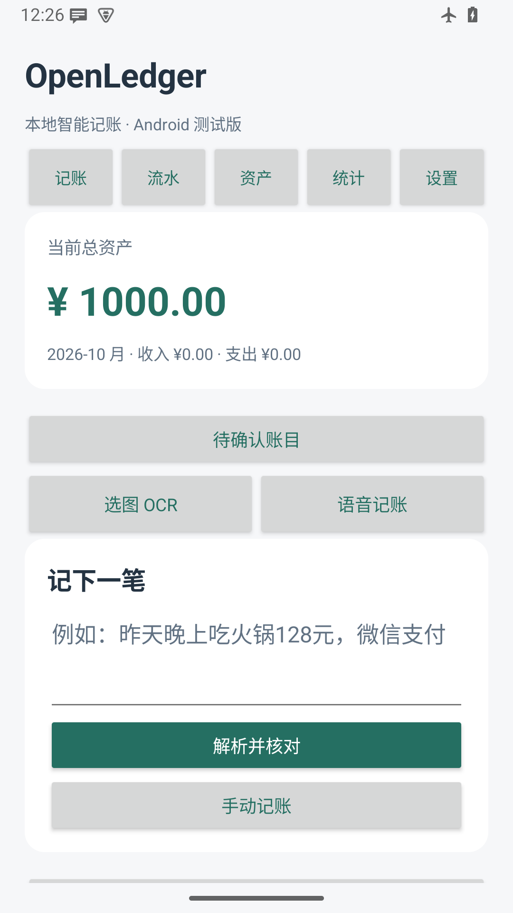
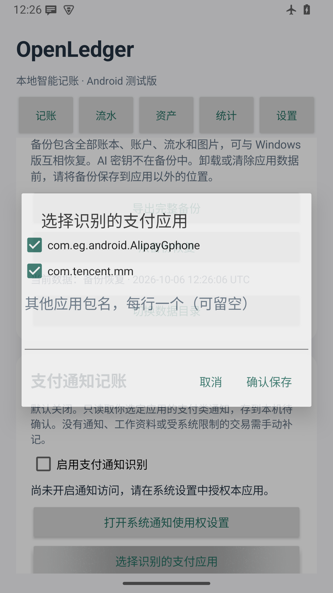
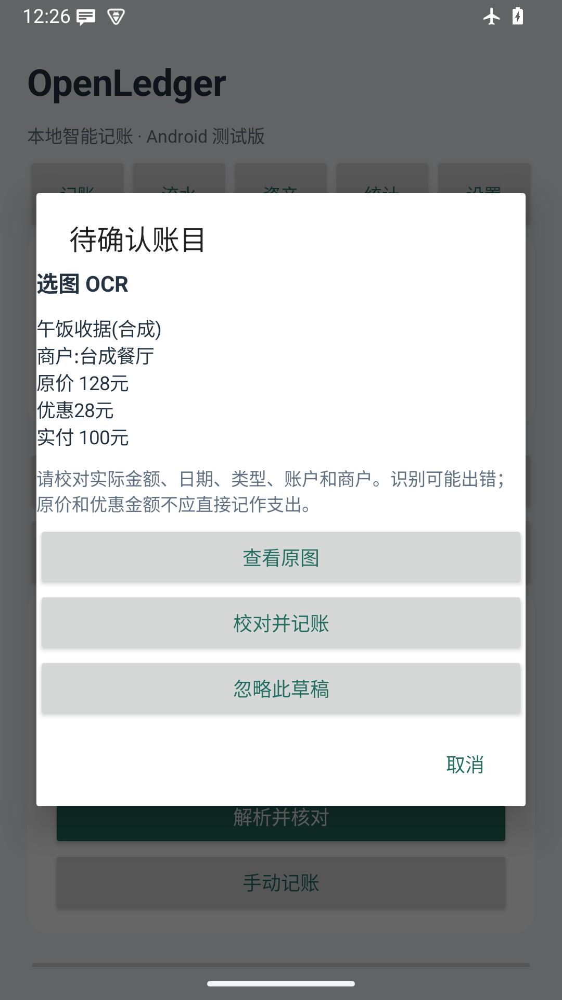
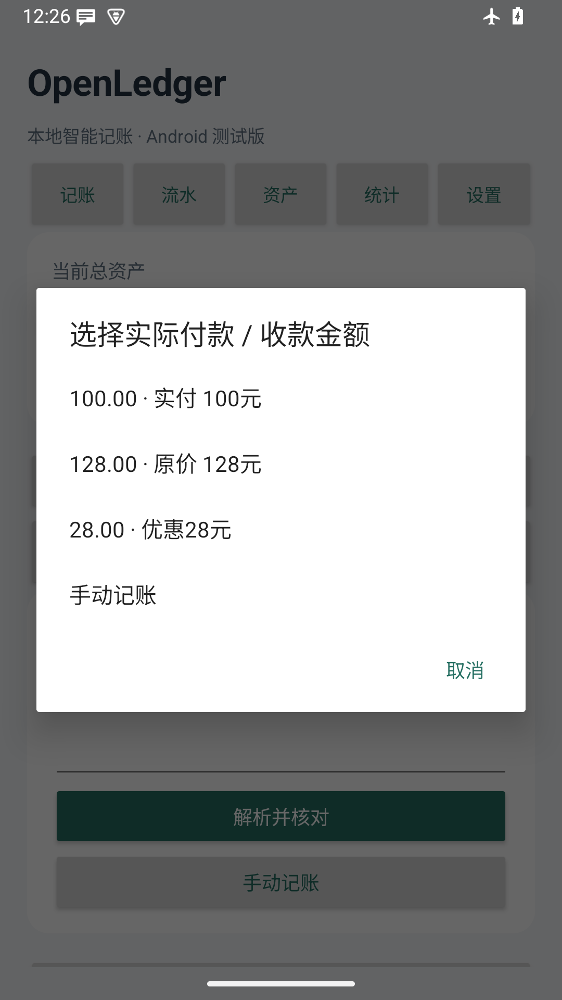
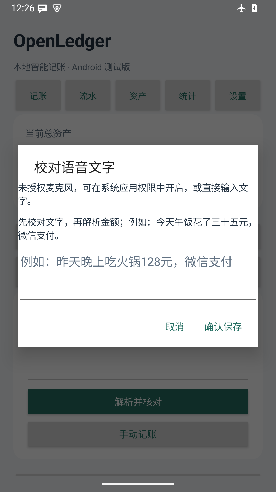
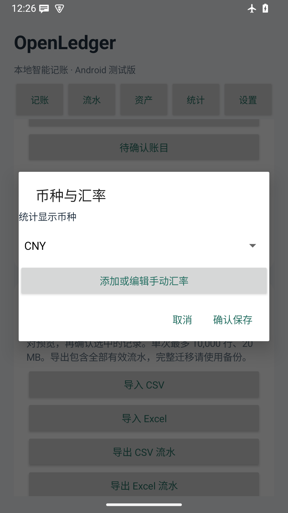

# OpenLedger 完整使用手册

适用版本：Android 0.3.0-beta1-preview、Windows 1.1.0rc1。更新日期：2026-10-06。

本手册覆盖从安装、第一笔记账到备份和排错。示例、截图中的金额与商户均为合成数据。
手机的「设置 → 完整使用手册（离线）」包含本手册，不需要登录 GitHub 或联网。

## 1. 下载、安装与升级

从项目 GitHub Releases 下载文件。Android 选择名称带 `android-preview.apk` 的安装包；
Windows 安装版选择 `Setup.exe`，便携版选择 `portable.zip`，源码仅供自行运行与开发。

Android 要求 Android 7.0 / API 24 及以上，支持 ARM64 手机和 x86_64 模拟器。
本版本是公开测试版，使用与旧预览版一致的调试证书签名。正式发布证书迁移仍是后续工作。
首次安装时，按系统提示临时允许下载 APK 的浏览器或文件管理器「安装未知应用」。
安装后可以关闭该来源权限。打开应用无需注册，初始仅有「我的账本」，不会虚构账户或余额。

升级前先导出 `.olbackup` 完整备份，再直接安装新 APK 覆盖旧版本，勿先卸载。
相同包名和签名的覆盖安装保留本机数据；新版本会先保存迁移前数据库副本，再升级格式。
如果系统提示签名冲突，请停止覆盖安装，核对下载来源和包名，勿为绕过提示而卸载旧版。
公开测试版包名为 `org.openledger.android.preview`，未来正式版迁移方法将另行说明。

Windows：运行安装程序，按提示选择安装位置；便携版解压整个文件夹后运行 `OpenLedger.exe`。
保留随附资源目录。默认财务数据存放在当前用户本地应用数据目录，不会因替换程序而自动删除。
源码运行需 Python 3.12，按 README 安装锁定依赖后执行 `python main.py`。

新版备份采用数据库格式 2，需新版 Android 或 Windows 1.1.0rc1 及以后读取。
Android 0.2 和 Windows 1.0 不支持新版备份；新版可以读取并迁移格式 1 的旧备份。
跨设备恢复不会自动合并两个账本，恢复的数据位于独立目录，可随时切回原数据。

## 2. 首次设置：账本、账户与支付渠道

打开「资产 → 新建账户」，输入名称、账户类型、币种、期初余额和开始记账日期。
期初余额应是起算日期开始时的真实余额；若从今天开始，不要再导入今天之前的流水。
负债型余额可填负数；金额不能超过账户与交易的安全整数范围。
例如：创建「现金」，币种 CNY，期初余额 1000，起算日期今天。
创建「银行卡」期初余额 0，然后在管理中设置常用默认账户。

账户币种创建后固定，不能通过改名把人民币余额变成美元余额。
选错币种时，请新建正确币种的账户，按实际金额换汇转账，再归档旧账户。
币种精度不同：JPY 不带小数，CNY / USD 两位小数，KWD 三位，CLF 四位；额外精度会拒绝保存。

在「设置 → 资料管理 → 支付渠道」编辑微信或支付宝，绑定其对应账户。
支付渠道是付款方式，账户才是实际扣款或到账的资金容器；绑定后解析仍须你确认。
微信未绑定时，软件可能建议默认账户，请核对，避免扣错账户。
可在管理中创建旅行、学习、家庭等账本，并将常用账本设为默认。



## 3. 第一笔：输入、解析、核对、保存

在「记账」输入 `今天咖啡花了25元，现金支付`，点击本地解析。
确认支出、金额 25、日期、现金账户、账本和分类；没有识别到的字段可手动填写。
账户选择旁会显示币种，输入金额始终属于所选账户，不会因切换账户自动换汇。
点击保存后，现金余额由 1000 变成 975；到「流水」打开该记录可查看分录与详情。

自然语言示例：`昨天晚上和朋友吃火锅花了128元，微信支付`。
软件可以建议昨天、晚上、餐饮和微信渠道，朋友作为对象；商户与地点需按实际情况校对。
`今天午饭花了三十五元，微信支付` 支持中文金额。
一次存在多笔或多个金额时，先选择正确候选；无法确定时使用手工录入。
模糊时间不会虚构具体时刻；日期只选到账发生日，退款日期不能早于原支出日期。

识别与保存分开。输入、预览、OCR 或通知产生草稿均不会改变余额。
保存失败时保留原确认；如提示待重试，请使用应用提供的重试按钮，勿反复新建同一笔。
已提交的同一个确认再次重试会返回原结果，不会重复扣款。

## 4. 日常维护

在「流水」搜索备注、对象或商户，按日期、账户、账本、分类或标签筛选。
点击记录可编辑、删除、恢复、查看图片附件。删除是保留历史的软删除，会撤销该笔余额影响；
恢复会重新应用原分录。有关联退款的支出不能直接删除，先处理退款。
归档账户、分类或账本保留历史；账户归档后余额仍计入资产。

转账：选择不同的转出、转入账户。相同币种填写等额金额，转账不属于收入或消费。
不同币种须填写实际扣款金额和实际到账金额；例如 USD 扣 10.00、CNY 到账 72.00。
此处不套用统计汇率，也不推测银行报价。手续费另记支出，实际兑换损益会体现在资产估值中。

退款：从原支出详情选择退款，或在待确认记录中选择原支出。
退款可分多次，累计不得超过原支出，退款账户须与原支出的币种相同。
原支出和退款币种不同的场景，先按原币记录退款，再按实际到账额记录换汇转账。
退款在发生月份冲减净支出，保留原支出月份和分类关系，不改写原消费金额。

余额校准：账目与实际余额不一致时，先排查漏记和重复记录，仍需修正可输入当前实际余额及原因。
软件记录一条校准分录，校准不计入普通收入 / 支出。不要用期初余额反复覆盖历史差额。
期初修改使用专用操作；若涉及已有流水，按界面提示处理依赖。

标签可以多选。图片附件支持 PNG、JPEG、WebP，每张不超过 20 MB。
附件选择后复制到应用本机目录；完整备份包含历史附件及待确认 OCR 原图。

## 5. 支付通知自动记账

此功能默认关闭。在「设置 → 支付通知记账」启用识别，选择微信、支付宝或明确填写其他应用包名，
再点击「打开系统通知使用权设置」，在 Android 系统页面授权 OpenLedger。
应用显示访问状态；授权后返回设置页面即可查看。无需授权全盘存储或无障碍服务。
系统通知使用权本身可能允许访问较多通知，本应用仅处理你选中的来源，不会上传通知内容。



仅新的支付类通知进入「待确认账目」。打开列表，核对原文、金额、类型和账户，再保存。
付款建议支出，收款建议收入，转账进入双账户表单，退款需要选择原支出。
识别不完整时可以改类型、改金额；不属于财务交易的通知直接忽略，误忽略可恢复。

同一来源事件的通知更新会更新已有待确认草稿，不另记一笔；已保存或忽略的同一事件不会重新入账。
去重使用来源与通知事件标识 / 时间，不会仅因文字和金额相同合并两次真实消费。
若支付应用重发新标识的通知，或另用 OCR 重复导入同笔交易，仍可能生成另一个草稿，请人工忽略。
请校对已保存流水，避免把一笔付款通知与另一笔聊天转述都保存。

无法通知覆盖所有交易：应用未发送通知、通知内容隐藏、系统限制、工作资料中的应用等情况需要补记。
手机重启、系统省电或权限撤销可能中断通知服务；重新检查授权，并手工补记漏掉的交易。
开启功能不会扫描旧通知来补账。实际支付应用的通知格式不同，建议先用少量真实通知验证识别效果。
关闭应用中的开关即可停止处理；在系统设置撤销访问权可进一步关闭通知访问。

## 6. 截图与收据 OCR

点击「记账 → 选图 OCR」，通过系统文件选择器选择清晰、完整的原图。
中文识别模型随 APK 打包，无需首次下载模型，无需 Google Play 服务，识别过程可离线运行。
本功能不自动读取相册，也不要求相册全量权限；原图和识别文本保存在本机。

识别完成后显示原文及「查看原图」。若有原价 128、优惠 28、实付 100，选择 100。
候选会显示附近文字，软件优先展示有「实付 / 实收」线索的金额，仍由你选择和确认。
订单号、商品数量、折扣和多个数字可能误识别为候选；金额错误时手工填写。
确认类型、日期、账户、商户并保存后，原图同时作为该账目的附件保存。




OCR 不保证识别准确。倾斜、反光、小字或模糊图片可裁剪 / 旋转后重选；
拍摄凭证可能不含真实付款金额，请结合支付记录核对。
相同图片重复识别会打开已有来源记录；不同截图代表同一交易时仍需人工排查重复。
忽略的原图为历史保留，进入完整备份；卸载或清除数据前导出完整备份。

## 7. 语音记账

点击「语音记账」，首次使用按需允许麦克风，清晰说一句账目，例如：
`今天午饭花了三十五元，微信支付`。识别结束后先校对文字，再进入同一待确认流程。
录音仅在前台点击后进行，不持续监听，不在账本保存原始录音。

如果 Android 提供本机离线语音服务，应用优先使用该服务。
如果没有本机服务但有普通系统识别服务，应用会明确提示音频可能联网，获你确认后才调用。
系统服务的中文支持与模型可用性由设备决定，离线服务存在也不代表中文模型一定已安装。
本应用不会把录音发送给配置的 AI 服务；普通系统语音服务可能有自己的联网行为。



无服务、拒绝麦克风、网络不通或识别失败时，可以直接进入文字输入。
权限拒绝后不会反复强制弹窗；需要时从 Android 应用权限中启用麦克风。
关闭识别弹窗或离开应用会停止本次识别。识别文本金额仍须核对，不能把识别结果当作已记账。

## 8. 多币种与统计口径

软件采用固定的 ISO 4217 精度表，支持 165 个有明确最小单位的币种 / 资金代码。
原币金额按最小单位整数保存，不使用浮点数存储余额。输入时按界面显示的账户币种填写。

打开「设置 → 设置显示币种与汇率」。统计显示币种可选 CNY、USD、JPY 等。
手动汇率统一定义为：`1 单位外币 = 填写数值 CNY`。
例如演示 USD 汇率 7.2 表示 1 USD = 7.2 CNY，JPY 汇率 0.05 表示 1 JPY = 0.05 CNY。
示例是合成值，不是当前市场汇率；软件不会联网获取报价，也不提供投资建议。
可填写生效日期、备注，保存后可以点击已有记录编辑，改动留有审计记录。



账户余额显示原币；总资产以今天或之前最近的手动汇率估值。
每笔统计按该笔发生日或之前最近的有效汇率换算，并按显示币种最小单位四舍五入。
负数换算使用同样的半数远离零规则。跨币种先以人民币为桥梁精确换算，再一次舍入。
因此显示币种切换或逐笔舍入可能出现小额统计差异，均不改变原币余额。
编辑历史汇率会改变相应日期的显示估值；交易和实际换汇双方金额保持原样。

缺少汇率时首页显示「未完整估值」，缺失部分的收入 / 支出显示横线；
统计页拒绝生成不完整报告，提示补充适用日期的汇率。软件不会把缺失币种当成零。
同币种统计和零余额不需要报价。补充汇率后刷新统计与报告。
总资产包含已归档账户；转账、期初和校准不计入收支；退款在退款月冲减净支出。

统计可查看月度趋势、分类占比、商户 / 对象 / 分类排行以及前期比较。
分类占比以原支出为基数，退款和净支出另列；金额排行与笔数排行使用各自的明确口径。
导出的 PDF / PNG 与当前显示报告使用同一快照、筛选条件、币种和数据版本。

## 9. CSV / Excel 导入、导出

导入前先导出完整备份。进入「设置 → 数据交换」选择 CSV 或 Excel 文件，
选择编码和工作表，映射字段，并指定默认账本、账户及收支分类。
UTF-8 推荐；部分中文银行 CSV 使用 GB18030，可选择相应入口。
Excel 支持 `.xlsx`，不直接支持旧 `.xls` 或含宏文件；可先另存为 `.xlsx`。

必要列包含类型、金额、日期；使用简短中文列名即可，例如：

```csv
类型,金额,日期,备注,币种
支出,25.00,2026-10-06,合成咖啡,CNY
收入,100.00,2026-10-06,合成报销,CNY
```

Release 随附 examples 包含 CSV 与 Excel 合成样例、跨币种转账样例和说明。
使用中文金额列时写主单位；软件原生导出的 `amount_minor` 使用币种最小单位整数。
JPY `amount_minor=500` 是 500 JPY；USD `amount_minor=500` 是 5.00 USD。
转账导入需要转出 / 转入账户；跨币种另提供转入金额或 `to_amount_minor`，不得省略实际到账额。
外部导出账户名称须与本机资料一致，或通过导入映射指定；币种必须与所选账户一致。

预览会显示错误行、明确重复及可能重复。金额精度、日期、公式单元格或关联不合法的行不能提交。
明确重复会阻止再次导入；可能重复需要你检查后选择。不得通过勾选强行绕过错误。
只有明确选中的有效行会在一次事务中写入；失败整体回滚，没有半批次入账。
导入后可在批次记录中撤销；已有相关退款、后续修改等依赖时按提示处理，不能绕过依赖删除。

CSV / Excel 导出是流水表，不包含全部审计、操作回执、设置和图片，不能代替完整备份。
期初和余额校准可能出现在导出中，但不能当收支流水再次导入；恢复这些记录请用完整备份。
表格中的公式样式文本会做安全转义；再次使用软件原生导出格式导入时会按格式标记还原。
普通表格软件显示的金额 / ID 和原生字段不应随意改成浮点值；保留完整 UUID 与最小单位整数。

## 10. 完整备份、恢复与手机 / 电脑迁移

打开「设置 → 创建完整备份」，使用系统文件选择器保存 `.olbackup`，
建议留一份在设备外的安全位置，并核实文件不是空文件。
它包含一致数据库快照、流水、账户、标签、待确认账目、附件、审计、回执和手动汇率。
API 密钥及系统通知 / 麦克风授权不会随财务备份迁移，请在新设备重新配置。
备份含敏感财务内容，本身未加密，请妥善保存或使用你信任的加密存储工具。

恢复：选择完整备份并确认。软件验证清单、大小、文件哈希、数据库和资金关联，
恢复到新的独立数据目录，成功后切换到该目录；原有数据不被覆盖。
可用「设置 → 切换数据」返回原数据。重复重试同一次恢复不会新建重复副本。
恢复失败时原数据保留，请核对是否完整复制、是否版本过新、是否磁盘空间不足。
不要自行改 ZIP、清单或数据库版本来绕过校验。

手机迁移到电脑：导出 `.olbackup`，传输原文件到运行新版 Windows 的电脑，
关闭桌面应用后，在 PowerShell 中运行下面的维护命令（按实际安装位置和备份位置替换）：

```powershell
& "$env:LOCALAPPDATA\Programs\OpenLedger\OpenLedger.exe" --restore "D:\Backups\mobile.olbackup" --restore-to "D:\OpenLedger-Restored"
& "$env:LOCALAPPDATA\Programs\OpenLedger\OpenLedger.exe" --data-dir "D:\OpenLedger-Restored"
```

便携版把可执行文件路径替换成解压目录中的 `OpenLedger.exe`。
电脑导出完整备份时关闭应用，再执行：

```powershell
& "$env:LOCALAPPDATA\Programs\OpenLedger\OpenLedger.exe" --backup "D:\Backups\desktop.olbackup"
```

自定义数据目录在备份时另加 `--data-dir "你的数据目录"`；备份文件不能覆盖已有文件。
源码运行可将上述可执行文件替换为 `python main.py`。
电脑迁移到手机：导出同格式完整备份，手机选择该文件并恢复。
两端都应使用本手册对应版本，核对账户原币余额、待确认图片及资产估值后再整理旧设备。

卸载、清除应用数据、重置手机或切换签名前必须先导出并验证备份。
Android 系统云备份与设备间自动迁移已禁用；本机财务数据不会依靠 Android 自动云备份恢复。
本版本没有自动云同步，多台设备分别记账后不会自动合并，勿以为复制 APK 就会带走账本。

## 11. 可选 AI、插件与联网行为

本地规则、通知识别、OCR 和账本操作无需 AI。
AI 默认关闭且不绑定服务；设置兼容 API 地址、模型和自己的 API 密钥后才可使用。
手机密钥用 Android Keystore 保护，不显示到日志，不放入财务备份或导出表格。
AI 解析需显式点击，向所配置服务发送当前输入和必要分类 / 账户候选，不发送整个账本。
请确认你信任该 API 服务；通知 / OCR / 语音不会自动发给 AI。
网络错误或密钥失效可改用本地解析，关闭 AI 不影响已保存数据。

「检查更新」显式访问 GitHub Releases，只检查、提醒，不自动下载或安装。
普通系统语音服务可能联网，前文所述确认仅针对本次调用。
本地 OCR 使用随包模型，不调用付费 OCR 服务。Google ML Kit SDK 可能向 Google 发送设备、应用和性能诊断信息，不包含输入图片和识别结果；首次使用前会提示，取消可使用文字输入。应用启动时不会初始化 OCR SDK。
云同步接口和插件接口已预留，本版本没有云同步服务器和插件市场，也没有自动安装第三方插件。

## 12. 常见问题与处理方法

| 问题 | 处理步骤 |
| --- | --- |
| APK 安装失败 | 核对 Android 版本、ARM64 / x86_64 架构、文件完整性和签名；确认未知来源授权。签名冲突先备份并核对来源，勿直接卸载旧版。 |
| 通知没有进入待确认 | 核对应用开关、所选包名、系统通知访问权、支付应用是否实际发了通知；工作资料、内容隐藏、省电限制可能影响服务，漏记可手工补记。 |
| 通知出现两条相似草稿 | 检查是否更新用了新事件标识、不同来源重复捕获或两次真实消费；核对流水后忽略重复，不直接按文字去重。 |
| 原价、优惠被当成金额 | 查看原图和候选附近文字，选择实付；不确定就手工填写，再核对账户余额。 |
| OCR 无文字 / 文字错误 | 使用清晰原图、正确方向，避免反光；检查文字后再保存，必要时回退文字输入。 |
| 语音按钮不能识别 | 系统可能没有中文语音服务或模型；检查麦克风权限，用文字回退。普通系统服务可能需要联网，本机服务可用性由设备决定。 |
| 汇总显示横线或未完整估值 | 添加外币在交易日 / 今天或更早的手动汇率，确认显示币种也有报价，再刷新。原币余额不受缺失汇率影响。 |
| JPY 小数保存失败 | 日元最小单位精度为 0，改填整数；其他币种按其允许精度，不要通过改币种绕过。 |
| 余额与支付软件不一致 | 检查期初、起算日期、遗漏、重复、转账到账额与退款；校对后使用专用余额校准，并填写原因。 |
| 退款保存失败 | 原支出必须存在、未删除，退款日期不能更早，累计不能超出原额，到账账户币种要一致。 |
| 保存提示版本冲突 | 有其他修改或通知更新。刷新并重新打开记录校对；旧草稿不会强行覆盖新数据。 |
| 保存提示磁盘 / 存储错误 | 释放空间，检查存储权限与路径，使用待确认重试入口；不要重复新建已提交的账目。 |
| 导入失败 / 部分行红色 | 核对编码、表头映射、日期、金额精度、账户 / 分类、公式单元格；修正文件再预览，不跳过资金校验。 |
| 恢复失败 | 核对完整 `.olbackup` 文件、版本、哈希和空闲空间；原数据仍在，保留错误码与版本便于排查。 |
| 卸载后没有账本 | 本机数据被卸载删除，使用设备外保存的完整备份恢复；仅有 CSV 时需重新建立资料并核对，不会还原所有历史。 |

报告问题时请提供版本、Android / Windows 版本、复现步骤和界面错误码。
不要把个人账本、支付通知、真实收据、API 密钥或未脱敏完整备份上传到公开 Issue。

项目仓库：https://github.com/Bidao-Penknife/OpenLedger
发布下载：https://github.com/Bidao-Penknife/OpenLedger/releases
